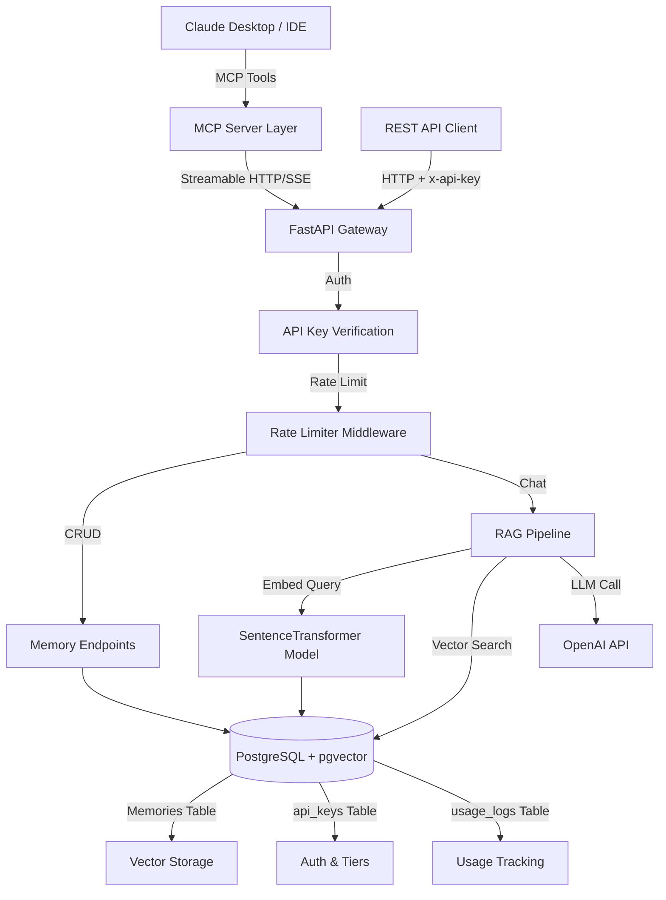
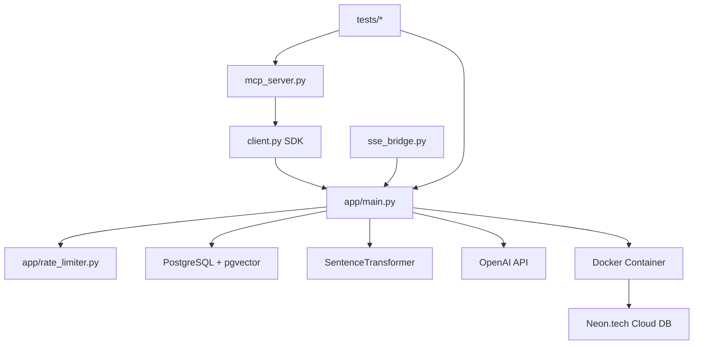

# Aethera Cortex v2.1 - Architecture Documentation

**Branch:** `copilot/generate-standardized-documentation`  
**Last Updated:** 2026-01-21  
**Status:** 🟢 Production-Ready (MCP Protocol + Cloud Native)  
**Progress:** ✅ Core Features Complete | ⚠️ Documentation In Progress

---

## Propósito do Projeto

**Aethera Cortex** é uma plataforma de **Memória Soberana & Gestão de Contexto** que permite que agentes de IA (como Claude Desktop) mantenham memória de longo prazo usando embeddings vetoriais e busca semântica.

### Principais Objetivos

1. **Persistência de Memória**: Armazenar conversas, fatos e contexto de forma permanente
2. **Busca Semântica**: Recuperar informações relevantes usando embeddings vetoriais (pgvector)
3. **Multi-Tenant**: Suporte a múltiplos usuários com autenticação via API keys e rate limiting
4. **MCP Integration**: Integração nativa com Model Context Protocol para IDEs e Claude Desktop
5. **Cloud Native**: Arquitetura pronta para produção com PostgreSQL (Neon) e Docker

---

## Arquitetura de Alto Nível

### Fluxo End-to-End (Diagrama Principal)



### Componentes e Dependências



---

## Mapa Mental da Estrutura de Pastas

```
/home/runner/work/uni-memory/uni-memory/
├── app/                          # Core application module
│   ├── main.py                   # FastAPI server (1037 lines) - Main entry point
│   ├── rate_limiter.py           # Rate limiting & usage tracking module
│   └── __init__.py
│
├── tests/                        # Test suite
│   ├── test_auth.py              # Authentication security tests
│   ├── test_crud.py              # Memory CRUD operation tests
│   ├── test_rate_limits.py       # Rate limiting enforcement tests
│   ├── test_sdk.py               # SDK client integration tests
│   └── debug_access.py           # Debug authentication helper
│
├── teste-de-validacao/           # Performance validation experiments
│   ├── server.py                 # FAISS benchmark server
│   ├── attack.py                 # Load testing script
│   ├── faiss_search.py           # Vector search performance test
│   ├── app.py                    # Alternative implementation
│   └── requirements.txt
│
├── .roo/                         # MCP configuration for Roo IDE
│   └── mcp.json                  # Streamable HTTP transport config
│
├── mcp_server.py                 # MCP Server (standalone mode for Claude Desktop)
├── client.py                     # Python SDK for Aethera Cortex API
├── sse_bridge.py                 # SSE bridge for legacy MCP transport
├── inspect_mcp.py                # MCP server debugging tool
├── debug_client.py               # Client debugging helper
├── mock_provider.py              # Mock provider for testing
│
├── Dockerfile                    # Container image definition
├── docker-compose.yml            # Docker orchestration
├── requirements.txt              # Python dependencies
└── .env                          # Environment configuration (not committed)
```

---

## Conceitos-Chave

### 1. **Multi-Tenancy & Tier-Based Access**
- Sistema de API keys com 4 tiers: `free`, `pro`, `team`, `root`
- Rate limiting diferenciado por tier
- Usage tracking granular por action type

### 2. **Vector Embeddings & RAG**
- Modelo: `sentence-transformers/all-MiniLM-L6-v2` (384 dim)
- pgvector extension para busca de similaridade
- Combina memória de curto prazo (últimas 3 mensagens) + longo prazo (RAG)

### 3. **Model Context Protocol (MCP)**
- Suporte a 2 transportes: SSE (legacy) e Streamable HTTP (2025-03-26 spec)
- Ferramentas: `remember`, `recall`, `list_recent`, `update_memory`, `forget`
- Integração com Claude Desktop e IDEs (Roo)

### 4. **Rate Limiting & Usage Tracking**
- In-memory cache + PostgreSQL persistence
- 4 tipos de ações: `request`, `memory_write`, `embedding`, `llm_call`
- Reset diário (midnight UTC)
- Cleanup automático de logs antigos (90 dias)

### 5. **Cloud Native Design**
- PostgreSQL remoto (Neon.tech)
- Docker ready com healthchecks
- Async I/O com FastAPI + Uvicorn
- Middleware-based auth & rate limiting

---

## Entry Points

### 1. **FastAPI Server** (app/main.py)
**Comando:** `uvicorn app.main:app --host 0.0.0.0 --port 8001`
- Servidor principal
- Expõe REST API + MCP endpoints
- Inicializa embeddings model e banco de dados

### 2. **MCP Server** (mcp_server.py)
**Comando:** `python mcp_server.py` (via Claude Desktop stdio)
- Standalone MCP server para Claude Desktop
- Usa client.py SDK para comunicar com backend
- Configurado via `.roo/mcp.json` ou Claude Desktop settings

### 3. **SSE Bridge** (sse_bridge.py)
**Comando:** `python3 sse_bridge.py <SSE_URL>`
- Bridge entre SSE transport e MCP stdio
- Usado para IDEs que não suportam HTTP direto

### 4. **Docker Container**
**Comando:** `docker-compose up -d`
- Sobe servidor em container isolado
- Expõe porta 8001
- Requer `.env` com DATABASE_URL e OPENAI_API_KEY

---

## Modelo de Dados

### Tabelas Principais (PostgreSQL)

#### 1. **memories**
```sql
CREATE TABLE memories (
    id SERIAL PRIMARY KEY,
    session_id TEXT NOT NULL,      -- Namespace de isolamento
    role TEXT NOT NULL,             -- 'user' | 'assistant'
    content TEXT NOT NULL,          -- Texto da memória
    timestamp REAL,                 -- Unix timestamp
    embedding vector(384)           -- pgvector embedding
)
```

#### 2. **api_keys**
```sql
CREATE TABLE api_keys (
    key TEXT PRIMARY KEY,           -- sk_aethera_...
    owner_name TEXT NOT NULL,
    is_active BOOLEAN DEFAULT TRUE,
    created_at REAL,
    tier TEXT DEFAULT 'free'        -- 'free' | 'pro' | 'team' | 'root'
)
```

#### 3. **tier_definitions**
```sql
CREATE TABLE tier_definitions (
    tier TEXT PRIMARY KEY,
    display_name TEXT NOT NULL,
    max_requests_per_day INTEGER DEFAULT 100,
    max_memories INTEGER DEFAULT 1000,
    max_embeddings_per_day INTEGER DEFAULT 50,
    max_llm_calls_per_day INTEGER DEFAULT 0,
    priority INTEGER DEFAULT 0,
    created_at REAL
)
```

#### 4. **usage_logs**
```sql
CREATE TABLE usage_logs (
    id SERIAL PRIMARY KEY,
    api_key TEXT NOT NULL,
    endpoint TEXT NOT NULL,         -- Ex: '/v1/memories'
    method TEXT NOT NULL,            -- 'GET' | 'POST' | ...
    action_type TEXT NOT NULL,       -- 'request' | 'memory_write' | ...
    timestamp REAL NOT NULL,
    response_status INTEGER,
    metadata JSONB,
    created_at TIMESTAMPTZ DEFAULT NOW()
)
```

### Relações
- `usage_logs.api_key` → `api_keys.key` (tracking de uso)
- `memories` não tem FK direta (multi-session por key)
- `api_keys.tier` → `tier_definitions.tier` (limites)

---

## Stack Tecnológica

### Runtime & Framework
- **Python 3.10+**
- **FastAPI** - API REST moderna com async
- **Uvicorn** - ASGI server
- **Pydantic** - Validação de schemas

### Database & Storage
- **PostgreSQL** - Database principal
- **pgvector** - Extension para embeddings vetoriais
- **psycopg2** - PostgreSQL adapter
- **Neon.tech** - Managed PostgreSQL (produção)

### AI & Machine Learning
- **sentence-transformers** - Embeddings model
- **OpenAI API** - LLM calls (gpt-3.5-turbo, gpt-4o)
- **NumPy** - Operações vetoriais

### MCP & Integration
- **mcp** (v1.3.0) - Model Context Protocol SDK
- **aiohttp** - Async HTTP client
- **anyio** - Async streams para SSE

### DevOps & Deployment
- **Docker** + **docker-compose**
- **requests** - HTTP client para testes
- **python-dotenv** - Gestão de env vars

---

## Features Implementadas

- [x] **Autenticação**: API Key-based com dual mode (header + query param)
- [x] **Rate Limiting**: Multi-tier com cache in-memory + DB persistence
- [x] **Usage Tracking**: Logs granulares por action type
- [x] **Admin Endpoints**: Criar/revogar keys, upgrade tiers, estatísticas
- [x] **Memory CRUD**: Create, Read, Update, Delete de memórias
- [x] **RAG Pipeline**: Embedding + pgvector search + LLM synthesis
- [x] **MCP Tools**: 5 ferramentas (remember, recall, list_recent, update, forget)
- [x] **MCP Transports**: SSE (legacy) + Streamable HTTP (2025-03-26)
- [x] **Multi-Session Support**: Isolamento por session_id
- [x] **Docker Deployment**: Container pronto para produção
- [x] **CORS**: Configurado para dev/test
- [x] **Observability**: Logging estruturado com Python logging
- [x] **DB Auto-Init**: Schema creation automático no boot
- [x] **Root Key Bootstrap**: Chave admin gerada na primeira execução

---

## Em Desenvolvimento / TODO

- [ ] **Environment Config**: Criar `.env.example` documentado
- [ ] **CI/CD Pipeline**: GitHub Actions para testes automatizados
- [ ] **OpenTelemetry**: Traces e métricas estruturadas
- [ ] **Multi-Tenant Memory**: Adicionar api_key FK na tabela memories
- [ ] **Webhook Support**: Notificações de eventos
- [ ] **Backup Strategy**: Rotinas de backup do PostgreSQL
- [ ] **Performance**: Benchmark e otimização de queries vetoriais
- [ ] **Security Hardening**: Audit logs, API key rotation
- [ ] **Frontend Dashboard**: UI para gerenciamento de memórias
- [ ] **Documentation**: API reference completa (OpenAPI)

---

## Padrões de Design Usados

### 1. **Middleware Chain** (FastAPI)
- Auth → Rate Limit → Business Logic
- Separação de concerns, reusabilidade
- Evidência: `McpAuthMiddleware`, `RateLimitMiddleware` em `app/main.py:217,246`

### 2. **Dependency Injection** (FastAPI Security)
- `verify_api_key` como Security dependency
- Reutilizado em todos endpoints protegidos
- Evidência: `Security(verify_api_key)` em `app/main.py:836+`

### 3. **Repository/DAO Pattern** (Implícito)
- Funções `add_memory_trace_logic`, `retrieve_context_logic`
- Encapsulam lógica de acesso a dados
- Evidência: `app/main.py:332,350`

### 4. **Singleton Pattern**
- Modelo de embeddings carregado 1x no boot
- Rate limiter instanciado globalmente
- Evidência: `embed_model`, `rate_limiter` em `app/main.py:45,185`

### 5. **Strategy Pattern** (MCP Transports)
- 2 estratégias: SSE vs Streamable HTTP
- Mesmas tools, diferentes protocolos
- Evidência: `/mcp` POST vs `/mcp/sse` GET em `app/main.py:559,729`

### 6. **Adapter Pattern** (Client SDK)
- `SovereignBrain` adapta API HTTP para interface Python
- Usado pelo MCP Server standalone
- Evidência: `client.py:6`, `mcp_server.py:23`

### 7. **Fire-and-Forget** (Background Tasks)
- Persistência de memórias em background
- Não bloqueia resposta ao cliente
- Evidência: `BackgroundTasks` em `app/main.py:378`

---

## Como Navegar o Código

### Ordem Recomendada para Entender o Sistema

1. **Start**: `app/main.py:1-50` - Config, imports, modelos
2. **Database**: `app/main.py:78-182` - Schema e bootstrap
3. **Auth**: `app/main.py:188-244` - API key verification + middlewares
4. **Core Logic**: `app/main.py:330-398` - Memory trace & RAG
5. **MCP Tools**: `app/main.py:409-554` - Definição das ferramentas
6. **MCP Transports**: `app/main.py:555-832` - HTTP e SSE handlers
7. **REST Endpoints**: `app/main.py:833-1033` - CRUD + Admin
8. **Rate Limiter**: `app/rate_limiter.py` - Lógica completa
9. **Client SDK**: `client.py` - Como usar a API
10. **MCP Server**: `mcp_server.py` - Integração com Claude

### Debugging Tips
- Logs: `logger.info(...)` marcados com `DEBUG` nos paths críticos
- Test Suite: `tests/test_*.py` - Exemplos práticos de uso
- Mock Provider: `mock_provider.py` - Simular dependências
- Inspect Tool: `inspect_mcp.py` - Ver estrutura do MCP server

---

## Convenções de Código

### Typing
- Type hints em **todas** funções públicas
- Pydantic models para request/response schemas
- Exemplo: `def verify_api_key(...) -> dict:` em `app/main.py:191`

### Async/Await
- Endpoints FastAPI são `async def`
- Database calls são síncronas (psycopg2)
- Background tasks para I/O não-bloqueante
- Exemplo: `async def chat_protocol(...)` em `app/main.py:858`

### Logging
- Logger nomeado por módulo: `logger = logging.getLogger("Aethera")`
- Níveis: INFO (flow), WARNING (rate limits), ERROR (failures)
- Prefixos: `[BOOT]`, `[RATE_LIMITER]`, `[ADMIN]`, `DEBUG`

### Validation
- Pydantic models validam payloads automaticamente
- HTTP exceptions com status codes semânticos (403, 404, 429)
- Exemplo: `class MemoryUpdate(BaseModel)` em `app/main.py:70`

### Errors & Exceptions
- HTTPException para erros de negócio
- Try/catch + logging para erros de infra
- Mensagens user-friendly em português
- Exemplo: `raise HTTPException(403, "Aethera Security: Chave inválida")`

### Config & Environment
- Variáveis: `DATABASE_URL`, `OPENAI_API_KEY`, `DB_SCHEMA`, `MCP_PUBLIC_URL`
- Defaults sensatos para desenvolvimento local
- Production overrides via `.env`

---

## Testing

### Como Rodar os Testes

#### Pré-requisitos
```bash
# 1. Subir o servidor (local ou docker)
uvicorn app.main:app --host 0.0.0.0 --port 8001

# 2. Configurar variáveis de ambiente
export DATABASE_URL="postgresql://..."
export OPENAI_API_KEY="sk-..."
export AETHERA_ROOT_KEY="sk_aethera_..."  # Para testes admin
```

#### Test Suites

**1. Authentication Tests**
```bash
python tests/test_auth.py
```
- Testa acesso com chaves válidas e inválidas
- Verifica rate limiting básico
- Cobertura: Auth middleware, API key validation

**2. CRUD Tests**
```bash
python tests/test_crud.py
```
- Testa criação, listagem, atualização e deleção de memórias
- Cobertura: `/v1/memories/*` endpoints

**3. Rate Limit Tests**
```bash
python tests/test_rate_limits.py
```
- Testa enforcement de limites por tier
- Testa usage tracking e reset diário
- Cobertura: Rate limiter module, usage_logs

**4. SDK Tests**
```bash
python tests/test_sdk.py
```
- Testa client.py SDK
- Learn, ask, CRUD operations
- Cobertura: End-to-end integration

**5. Performance Tests** (teste-de-validacao/)
```bash
# Servidor benchmark
python teste-de-validacao/server.py

# Load test
python teste-de-validacao/attack.py
```
- Testa latência de embeddings + FAISS
- Simula carga concorrente

### Mínimos Aceitáveis
- ✅ Todos testes devem passar sem erros
- ✅ Auth tests: 100% success rate
- ✅ CRUD tests: Todas operações retornam 200/404 apropriados
- ✅ Rate limit: Enforcement detectado (429)
- ⚠️ Performance: < 100ms p95 para RAG query (depende de hardware)

---

## Decisões Arquiteturais Importantes (Mini-ADRs)

### ADR-1: PostgreSQL + pgvector vs FAISS
**Contexto:** Precisamos de busca vetorial persistente e multi-tenant.  
**Decisão:** Usar pgvector no PostgreSQL ao invés de FAISS standalone.  
**Consequência:**  
- ✅ Persistência nativa, sem arquivos locais  
- ✅ Queries SQL tradicionais + vetoriais no mesmo DB  
- ✅ Backup/restore com estratégia padrão  
- ⚠️ Latência ligeiramente maior que FAISS puro (aceitável para caso de uso)

### ADR-2: MCP Streamable HTTP vs SSE-only
**Contexto:** MCP 2025-03-26 spec deprecia SSE, mas Claude Desktop ainda usa.  
**Decisão:** Suportar ambos transportes simultaneamente.  
**Consequência:**  
- ✅ Compatibilidade com IDEs modernos (Roo, Windsurf) via HTTP  
- ✅ Compatibilidade com Claude Desktop via SSE  
- ⚠️ Código duplicado entre `/mcp` e `/mcp/sse` (refatorável futuro)

### ADR-3: In-Memory Cache + DB para Rate Limiting
**Contexto:** Consultar DB a cada request é caro.  
**Decisão:** Cache in-memory com sync diário e logs no PostgreSQL.  
**Consequência:**  
- ✅ Performance: O(1) para checks, sem DB hit  
- ✅ Persistência: Audit trail completo  
- ⚠️ Reset diário requer sincronização (implementado via timestamp check)

### ADR-4: FastAPI Middleware Chain para Auth + Rate Limit
**Contexto:** Auth e rate limit são cross-cutting concerns.  
**Decisão:** Implementar como middlewares ao invés de decorators.  
**Consequência:**  
- ✅ Aplica-se automaticamente a todos endpoints  
- ✅ Ordem de execução explícita (Auth → Rate Limit → Endpoint)  
- ⚠️ Debug ligeiramente mais difícil (stack trace mais longo)

### ADR-5: Dual API Key Mode (Header + Query Param)
**Contexto:** MCP SSE não permite custom headers facilmente.  
**Decisão:** Aceitar `x-api-key` via header OU query parameter.  
**Consequência:**  
- ✅ SSE/WebSocket compatible  
- ✅ Mantém padrão REST para APIs normais  
- ⚠️ Query param em logs (mitigado: não logar URLs completas)

### ADR-6: Standalone MCP Server vs Embedded
**Contexto:** Claude Desktop precisa de stdio transport, mas servidor HTTP precisa rodar separado.  
**Decisão:** Criar `mcp_server.py` standalone que chama o backend HTTP.  
**Consequência:**  
- ✅ Claude Desktop suportado sem modificar servidor principal  
- ✅ Deployment independente (MCP server pode rodar na máquina do dev)  
- ⚠️ Extra hop (MCP → HTTP), mas latência aceitável

### ADR-7: SentenceTransformer Local vs API
**Contexto:** Embeddings são críticos e frequentes.  
**Decisão:** Rodar modelo local ao invés de usar OpenAI Embeddings API.  
**Consequência:**  
- ✅ Custo zero para embeddings  
- ✅ Latência previsível (~50ms)  
- ⚠️ Memória RAM (~500MB) e CPU no servidor  
- ⚠️ Modelo fixo (all-MiniLM-L6-v2), sem upgrade automático

---

## Próximos Passos Sugeridos

### Alta Prioridade
1. **`.env.example` Documentation** - Criar template com todas vars obrigatórias
2. **Multi-Tenant Memory Isolation** - Adicionar `api_key` FK na tabela `memories`
3. **API Key Rotation** - Endpoint para gerar nova key e revogar antiga
4. **Usage Dashboard** - Frontend básico para visualizar limites e uso

### Média Prioridade
5. **CI/CD Pipeline** - GitHub Actions para rodar test suite em PRs
6. **OpenAPI Docs Enhancement** - Enriquecer /docs com exemplos e auth flows
7. **Webhook Support** - Notificar serviços externos em eventos (novo key, limite atingido)
8. **Backup Automation** - Script para pg_dump diário + upload S3

### Baixa Prioridade
9. **Performance Profiling** - Benchmarks detalhados com locust/k6
10. **Security Audit** - Penetration testing e OWASP compliance
11. **Multi-Region Support** - Replicação de DBs para latência global
12. **GraphQL Gateway** - Alternativa ao REST para queries complexas

### Impacto Estimado
- **Alta**: Resolve bugs críticos ou bloqueia features core
- **Média**: Melhora significativa de DX ou produtização
- **Baixa**: Nice-to-have, não urgente

---

## Links Úteis

- **MCP Specification**: https://spec.modelcontextprotocol.io
- **pgvector Docs**: https://github.com/pgvector/pgvector
- **Neon PostgreSQL**: https://neon.tech
- **FastAPI Docs**: https://fastapi.tiangolo.com
- **SentenceTransformers**: https://www.sbert.net

---

_Documentação gerada em 2026-01-21 | Aethera Cortex v2.1_
