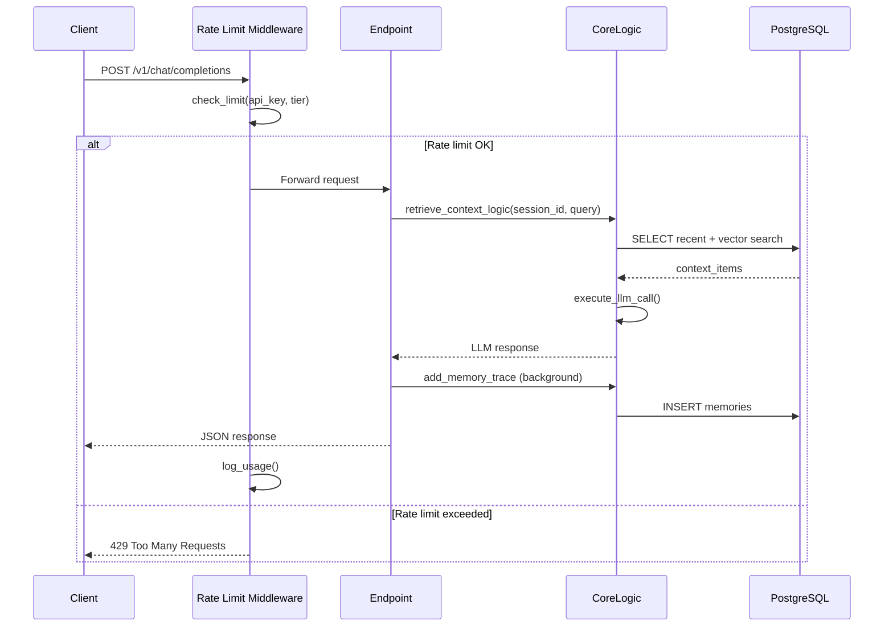

# App Module - Core Application

## Propósito do Módulo

Este módulo contém a **lógica principal** do Aethera Cortex:
- FastAPI server com REST API e MCP endpoints
- Sistema de autenticação e rate limiting
- Pipeline RAG (Retrieval-Augmented Generation)
- Gestão de memória vetorial com pgvector

É o **coração** da aplicação, responsável por orquestrar todos os componentes.

---

## Principais Arquivos

### 1. `main.py` (1037 linhas)
**Propósito:** Entry point principal, contém FastAPI app e toda lógica de negócio.

**Seções principais:**
- **Linha 1-50:** Imports, config, modelos Pydantic
- **Linha 78-182:** `init_db()` - Schema bootstrap do PostgreSQL
- **Linha 188-244:** Auth system (middlewares + verify_api_key)
- **Linha 332-398:** Core logic (memory trace, RAG retrieval, LLM calls)
- **Linha 409-554:** MCP tools definition e handlers
- **Linha 555-832:** MCP transports (Streamable HTTP + SSE)
- **Linha 833-1033:** REST endpoints (CRUD + Admin + Usage)

**Dependências externas:**
- PostgreSQL (via `DATABASE_URL`)
- OpenAI API (via `OPENAI_API_KEY`)
- SentenceTransformer model (local)

---

### 2. `rate_limiter.py` (261 linhas)
**Propósito:** Rate limiting e usage tracking com cache in-memory + PostgreSQL.

**Classes principais:**
- `RateLimiter`: Gerencia limites por tier e tracking de uso
  - `check_limit()`: Verifica se request está dentro do limite
  - `log_usage()`: Persiste log de uso no DB
  - `get_full_usage_stats()`: Retorna estatísticas completas

**Action types:**
- `ACTION_REQUEST`: Requisições gerais
- `ACTION_MEMORY_WRITE`: Gravação de memórias
- `ACTION_EMBEDDING`: Geração de embeddings
- `ACTION_LLM_CALL`: Chamadas para LLM

**Funções auxiliares:**
- `cleanup_old_logs()`: Remove logs > 90 dias (scheduled job)

---

### 3. `__init__.py`
**Propósito:** Marcador de pacote Python (vazio).

---

## Interfaces / Contratos Importantes

### 1. Auth Dependency
```python
async def verify_api_key(
    api_key_header_val: str = Security(api_key_header),
    api_key_query_val: str = Query(None, alias="x-api-key")
) -> dict:
    """
    Retorna: {"key": str, "owner": str, "tier": str}
    Raises: HTTPException(403) se inválida
    """
```

### 2. Memory Core Logic
```python
def add_memory_trace_logic(session_id: str, role: str, content: str):
    """
    Grava memória síncrona no PostgreSQL.
    - Gera embedding (384-dim)
    - INSERT na tabela memories
    Raises: Exception em falha de DB
    """

def retrieve_context_logic(session_id: str, query: str, limit_k: int = 5) -> List[Dict]:
    """
    Recupera contexto híbrido:
    - 3 últimas mensagens (short-term)
    - Top K similares por pgvector (long-term)
    
    Retorna: List[{"source": str, "role": str, "content": str}]
    """
```

### 3. LLM Execution
```python
def execute_llm_call(model_name: str, system_context: str, user_query: str) -> str:
    """
    Chama OpenAI API com contexto injetado.
    
    Args:
        model_name: "gpt-3.5-turbo" | "gpt-4o"
        system_context: RAG context formatado
        user_query: Pergunta do usuário
    
    Retorna: String de resposta do LLM
    """
```

### 4. Rate Limiter Interface
```python
class RateLimiter:
    def check_limit(self, api_key: str, action_type: str, tier: str) -> Tuple[bool, dict]:
        """
        Retorna: (is_allowed, usage_info)
        usage_info = {"used": int, "limit": int, "remaining": int, "unlimited": bool}
        """
    
    def log_usage(self, api_key: str, endpoint: str, method: str, 
                  action_type: str, status: int, metadata: Optional[dict] = None):
        """Fire-and-forget logging"""
```

---

## Fluxo do Módulo

### Fluxo 1: REST Request → Memory Storage



### Fluxo 2: MCP Tool Invocation

```
Claude Desktop → MCP Server (stdio)
                    ↓
                call_tool(name="recall", args={"query": "..."})
                    ↓
                retrieve_context_logic(session_id, query)
                    ↓
                PostgreSQL (pgvector search)
                    ↓
                Format response as TextContent
                    ↓
                Return to Claude via stdio
```

---

## Exemplos de Uso

### 1. Iniciar Servidor Local

```bash
# Com env vars inline
DATABASE_URL="postgresql://..." OPENAI_API_KEY="sk-..." \
  uvicorn app.main:app --host 0.0.0.0 --port 8001

# Ou com .env
# (criar .env com DATABASE_URL e OPENAI_API_KEY)
uvicorn app.main:app --reload
```

### 2. Fazer Request REST

```python
import requests

headers = {"x-api-key": "sk_aethera_..."}

# Gravar memória
response = requests.post(
    "http://localhost:8001/v1/chat/completions",
    json={
        "model": "memory-only",
        "session_id": "user123",
        "messages": [{"role": "user", "content": "Meu nome é João"}]
    },
    headers=headers
)

# Buscar na memória
response = requests.post(
    "http://localhost:8001/v1/chat/completions",
    json={
        "model": "gpt-3.5-turbo",
        "session_id": "user123",
        "messages": [{"role": "user", "content": "Qual é meu nome?"}]
    },
    headers=headers
)
```

### 3. Usar MCP Tools (via Claude Desktop)

```
User: "Lembre que meu café favorito é cappuccino"
→ Tool: remember(fact="café favorito é cappuccino", category="personal")

User: "Qual é meu café preferido?"
→ Tool: recall(query="café preferido")
→ Response: "café favorito é cappuccino"
```

### 4. Admin: Criar Nova API Key

```bash
curl -X POST http://localhost:8001/admin/keys/create \
  -H "x-api-key: ROOT_KEY" \
  -H "Content-Type: application/json" \
  -d '{"owner_name": "novo-usuario", "tier": "pro"}'

# Response: {"status": "created", "key": "sk_aethera_..."}
```

---

## Pontos de Atenção

### 1. ⚠️ Connection Leaks
**Problema:** `psycopg2` connections não são async. Esquecer de fechar causa leaks.

**Solução:**
```python
try:
    conn = get_db_connection()
    # ... operações
    conn.commit()
except Exception as e:
    logger.error(f"Error: {e}")
    raise
finally:
    if conn:
        conn.close()
```

### 2. ⚠️ Embedding Model em Memória
**Problema:** SentenceTransformer carrega ~500MB de RAM no boot.

**Impacto:**
- Container precisa de 2GB+ de memória (veja `docker-compose.yml`)
- Latência ~50ms por embedding (CPU-bound)

**Mitigação:**
- Usar background tasks para não blocker requests
- Considerar GPU para produção high-throughput

### 3. ⚠️ Rate Limiter Cache
**Problema:** Cache in-memory reseta no restart do servidor.

**Comportamento:**
- Primeiro request após restart consulta DB
- Requests subsequentes usam cache
- Reset diário (midnight UTC) limpa cache

**Invariante:** Usage logs no DB são **fonte da verdade**.

### 4. ⚠️ MCP Session Isolation
**Problema:** Múltiplos clients MCP compartilham o mesmo backend.

**Solução:** Usar `session_id` diferente por client:
- Default: "mcp-sse-session" (compartilhado)
- Produção: Gerar UUID por client connection

### 5. ⚠️ SQL Injection Prevention
**Regra:** SEMPRE usar parametrized queries.

```python
# ❌ ERRADO
c.execute(f"SELECT * FROM memories WHERE id = {memory_id}")

# ✅ CORRETO
c.execute("SELECT * FROM memories WHERE id = %s", (memory_id,))
```

### 6. ⚠️ OpenAI API Timeout
**Problema:** LLM calls podem travar se OpenAI está lento.

**Config atual:** `timeout=45` segundos (em `execute_llm_call`)

**Fallback:** Retorna string de erro, não trava o servidor.

---

## Testes do Módulo

### Comandos de Teste

```bash
# 1. Subir servidor
uvicorn app.main:app --host 0.0.0.0 --port 8001

# 2. Run test suite (em outro terminal)
python tests/test_auth.py         # Auth + Security
python tests/test_crud.py          # Memory CRUD
python tests/test_rate_limits.py  # Rate limiting
```

### Critérios de Sucesso

**test_auth.py:**
- ✅ Chave errada → 403
- ✅ Chave correta → 200
- ✅ Sem chave → 403

**test_crud.py:**
- ✅ POST /v1/chat/completions → 200
- ✅ GET /v1/memories → Lista memórias
- ✅ PUT /v1/memories/{id} → Atualiza
- ✅ DELETE /v1/memories/{id} → Remove

**test_rate_limits.py:**
- ✅ Free tier → Max 100 requests/day
- ✅ Após limite → 429 Too Many Requests
- ✅ Usage endpoint retorna stats corretos

### Coverage Manual

```bash
# Health check
curl http://localhost:8001/

# MCP endpoint (Streamable HTTP)
curl -X POST http://localhost:8001/mcp?x-api-key=KEY \
  -H "Content-Type: application/json" \
  -d '{"jsonrpc":"2.0","id":1,"method":"initialize","params":{}}'

# SSE endpoint
curl http://localhost:8001/mcp/sse?x-api-key=KEY
```

---

## Performance Tips

### 1. Batch Embeddings
Para processar múltiplas memórias:
```python
# ✅ MELHOR
embeddings = embed_model.encode([text1, text2, text3])  # Batch

# ❌ EVITAR
for text in texts:
    emb = embed_model.encode([text])  # Loop sequencial
```

### 2. pgvector Index
Para produção com muitas memórias:
```sql
-- Criar index IVFFlat para busca mais rápida
CREATE INDEX ON memories USING ivfflat (embedding vector_cosine_ops)
  WITH (lists = 100);
```

### 3. Connection Pooling
Considerar `psycopg2.pool` para reduzir overhead:
```python
from psycopg2 import pool
connection_pool = pool.SimpleConnectionPool(1, 10, DATABASE_URL)
```

---

## Debugging

### Logs Úteis

```bash
# Seguir logs do servidor
tail -f /var/log/aethera.log

# Filtrar por módulo
grep "\[RATE_LIMITER\]" logs.txt
grep "DEBUG \[MEMORY\]" logs.txt
grep "CRITICAL" logs.txt
```

### Inspecionar Database

```bash
psql $DATABASE_URL

# Ver memórias recentes
SELECT id, session_id, role, LEFT(content, 50) FROM memories 
ORDER BY id DESC LIMIT 10;

# Ver usage hoje
SELECT api_key, COUNT(*) FROM usage_logs 
WHERE DATE(created_at) = CURRENT_DATE 
GROUP BY api_key;

# Ver tiers
SELECT * FROM tier_definitions;
```

---

_Última atualização: 2026-01-21_
