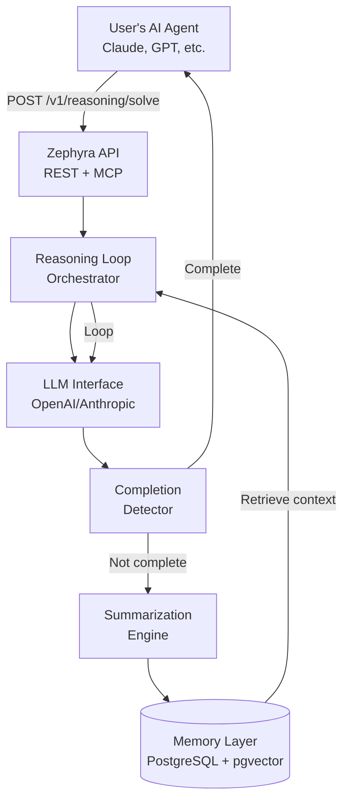

# Reasoning-as-a-Service

**Category**: Immediate Implementation (2-4 weeks)
**Priority**: 🔴 HIGH
**Status**: Proposal
**Dependencies**: None (builds on existing infrastructure)

---

## Vision

Transform Zephyra Cortex from a passive AI memory platform into an **active reasoning platform** that enables AI agents to solve complex, multi-step problems without hitting context window limits.

**Inspired by**: InftyThink+ paper (Feb 2025) on trajectory-level reinforcement learning for infinite-horizon reasoning.

**Core Concept**: Implement an iterative reasoning loop that:
1. Breaks complex problems into manageable segments
2. Automatically summarizes intermediate steps
3. Stores summaries in long-term memory
4. Retrieves relevant context for each iteration
5. Continues reasoning until solution is found or max iterations reached

**Competitive Differentiation**:
- **Mem0**: Passive storage only
- **Zep**: Basic retrieval without reasoning
- **Zephyra**: Reasoning-as-a-service with automatic memory management

**Value Proposition**: "Your AI agents can now tackle complex problems that would normally exceed their context window."

---

## Current State Analysis

### What Already Exists

Based on codebase exploration (`/home/user/uni-memory/app/main.py`):

✅ **Database**: PostgreSQL with pgvector extension (384-dimensional vectors)
✅ **Memory Storage**: `memories` table with owner_key isolation, workspace scoping
✅ **Vector Search**: pgvector cosine similarity with HNSW indexes
✅ **Embeddings**: SentenceTransformer (all-MiniLM-L6-v2) running locally
✅ **LLM Integration**: OpenAI API via `execute_llm_call()` function
✅ **API Framework**: FastAPI with rate limiting per tier
✅ **MCP Protocol**: FastMCP integration for Claude Desktop/IDEs
✅ **Multi-tenancy**: Per-API-key isolation with tiers (free/pro/team/root)
✅ **Usage Tracking**: `usage_logs` table with per-action-type limits

### What's Missing for Reasoning

❌ **Reasoning Loop Orchestrator**: No iterative problem-solving logic
❌ **Summarization Engine**: No automatic segment summarization
❌ **Completion Detection**: No logic to detect when problem is solved
❌ **Context Building**: No multi-turn reasoning context assembly
❌ **Session Management**: No tracking of reasoning sessions across segments

---

## Proposed Architecture

### High-Level Architecture



### Component Breakdown

#### 1. Reasoning Loop Orchestrator

**Responsibility**: Main state machine for iterative reasoning

**Algorithm**:
```python
def solve(problem, config, user_id, session_id):
    context = problem
    segments = []

    for i in range(config.max_segments):
        # 1. Generate reasoning segment
        segment = llm.generate(context, max_tokens=config.tokens_per_segment)

        # 2. Check completion
        if completion_detector.is_complete(segment):
            answer = extract_answer(segment)
            return Result(status="completed", answer=answer, trace=segments)

        # 3. Summarize segment
        summary = summarizer.summarize(segment, strategy=config.summarization_strategy)

        # 4. Store in memory
        memory_id = memory.store(user_id, summary, metadata={
            "session_id": session_id,
            "segment": i,
            "type": "reasoning_summary"
        })

        # 5. Retrieve relevant past context
        relevant = memory.search(user_id, query=problem, filters={"session_id": session_id})

        # 6. Build context for next iteration
        context = build_context(problem, summary, relevant)

        segments.append(segment)

    return Result(status="incomplete", trace=segments)
```

**Files**: `app/services/reasoning_loop.py` (new file, ~300 lines)

#### 2. LLM Interface

**Responsibility**: Abstraction layer for multiple LLM providers

**Supported Models**:
- OpenAI: `gpt-4o-mini`, `gpt-4`, `gpt-4-turbo`
- Anthropic: `claude-sonnet-4`, `claude-opus-4`
- Future: Local models (Llama, Gemma)

**Implementation**:
```python
class LLMClient(ABC):
    @abstractmethod
    async def generate(self, prompt: str, max_tokens: int, model: str) -> LLMResponse:
        pass

class OpenAIClient(LLMClient):
    async def generate(self, prompt, max_tokens, model):
        response = await openai.ChatCompletion.acreate(
            model=model,
            messages=[{"role": "user", "content": prompt}],
            max_tokens=max_tokens
        )
        return LLMResponse(text=response.choices[0].message.content)

class AnthropicClient(LLMClient):
    async def generate(self, prompt, max_tokens, model):
        response = await anthropic.messages.create(
            model=model,
            max_tokens=max_tokens,
            messages=[{"role": "user", "content": prompt}]
        )
        return LLMResponse(text=response.content[0].text)
```

**Files**: `app/llm/client.py` (new file, ~150 lines)

#### 3. Summarization Engine

**Responsibility**: Condense reasoning segments while preserving key information

**Strategies**:
- **always**: Summarize every segment using LLM
- **smart**: Only summarize if segment > 500 words, else keep as-is
- **auto**: Use heuristics to decide (default)

**Implementation**:
```python
async def summarize(segment: str, strategy: str = "auto") -> str:
    if strategy == "always":
        return await llm_summarize(segment)
    elif strategy == "smart":
        if len(segment.split()) > 500:
            return await llm_summarize(segment)
        return segment
    else:  # auto
        return await llm_summarize(segment)

async def llm_summarize(text: str) -> str:
    prompt = f"""Summarize this reasoning step concisely, keeping key facts and logic:

{text}

Summary (max 3 sentences):"""

    response = await llm.generate(prompt, max_tokens=200, model="gpt-4o-mini")
    return response.text.strip()
```

**Files**: `app/services/summarization.py` (new file, ~100 lines)

#### 4. Completion Detector

**Responsibility**: Identify when reasoning has reached a conclusion

**Approach**: Heuristic-based (MVP), can upgrade to ML classifier later

**Implementation**:
```python
def is_complete(segment: str) -> bool:
    """Detect if reasoning reached conclusion"""
    completion_markers = [
        "therefore, the answer is",
        "final answer:",
        "the solution is",
        "concluded that",
        "final result:",
        "answer:"
    ]

    segment_lower = segment.lower()
    return any(marker in segment_lower for marker in completion_markers)

async def extract_answer(segment: str) -> str:
    """Extract final answer from completed segment"""
    prompt = f"""Extract the final answer from this reasoning:

{segment}

Provide only the answer, no explanation."""

    response = await llm.generate(prompt, max_tokens=200, model="gpt-4o-mini")
    return response.text.strip()
```

**Files**: `app/services/completion_detector.py` (new file, ~80 lines)

#### 5. Memory Integration

**Responsibility**: Bridge reasoning loop with existing memory system

**Reuses**: Existing `memories` table and pgvector search

**Schema Extension**:
```sql
-- Add foreign key column to link memories with reasoning sessions
ALTER TABLE memories ADD COLUMN reasoning_session_id VARCHAR(255);
CREATE INDEX idx_memories_reasoning_session ON memories(reasoning_session_id);
```

**Context Building**:
```python
def build_context(original_problem: str, latest_summary: str, past_summaries: List[Dict]) -> str:
    """Construct context for next reasoning iteration"""
    context_parts = [
        f"Problem: {original_problem}",
        "\n=== Previous Reasoning Steps ==="
    ]

    for mem in past_summaries:
        context_parts.append(f"- {mem['content']}")

    context_parts.append(f"\nLatest step: {latest_summary}")
    context_parts.append("\nNext step:")

    return "\n".join(context_parts)
```

**Files**: Extends `app/main.py`, no new file needed

---

## Database Schema Changes

### New Table: reasoning_sessions

```sql
CREATE TABLE reasoning_sessions (
    id UUID PRIMARY KEY DEFAULT gen_random_uuid(),
    user_id UUID NOT NULL,
    owner_key VARCHAR(255) NOT NULL,
    session_id VARCHAR(255) NOT NULL UNIQUE,
    problem TEXT NOT NULL,
    status VARCHAR(50) NOT NULL, -- 'running', 'completed', 'incomplete', 'error'
    answer TEXT,
    total_tokens INTEGER DEFAULT 0,
    total_segments INTEGER DEFAULT 0,
    config JSONB, -- Store ReasoningConfig as JSON
    created_at TIMESTAMP DEFAULT NOW(),
    updated_at TIMESTAMP DEFAULT NOW(),

    FOREIGN KEY (owner_key) REFERENCES api_keys(key)
);

CREATE INDEX idx_reasoning_sessions_owner ON reasoning_sessions(owner_key);
CREATE INDEX idx_reasoning_sessions_session ON reasoning_sessions(session_id);
CREATE INDEX idx_reasoning_sessions_status ON reasoning_sessions(status);
CREATE INDEX idx_reasoning_sessions_created ON reasoning_sessions(created_at DESC);
```

### New Table: reasoning_segments

```sql
CREATE TABLE reasoning_segments (
    id UUID PRIMARY KEY DEFAULT gen_random_uuid(),
    session_id VARCHAR(255) NOT NULL,
    segment_number INTEGER NOT NULL,
    content TEXT NOT NULL,
    summary TEXT NOT NULL,
    tokens_used INTEGER,
    created_at TIMESTAMP DEFAULT NOW(),

    FOREIGN KEY (session_id) REFERENCES reasoning_sessions(session_id) ON DELETE CASCADE
);

CREATE INDEX idx_reasoning_segments_session ON reasoning_segments(session_id);
CREATE INDEX idx_reasoning_segments_number ON reasoning_segments(session_id, segment_number);
```

### Extend memories Table

```sql
-- Link memories to reasoning sessions
ALTER TABLE memories ADD COLUMN reasoning_session_id VARCHAR(255);
CREATE INDEX idx_memories_reasoning_session ON memories(reasoning_session_id);
```

### Migration File

**Path**: `/home/user/uni-memory/migrations/003_reasoning_service.sql`

---

## API Design

### REST Endpoints

#### POST /v1/reasoning/solve

Solve a complex problem using iterative reasoning with automatic memory.

**Request**:
```json
{
  "problem": "A train travels 120 km at 60 km/h, then 180 km at 90 km/h. What is the average speed?",
  "config": {
    "max_segments": 10,
    "tokens_per_segment": 1000,
    "model": "gpt-4o-mini",
    "summarization_strategy": "auto",
    "memory_context_k": 3,
    "temperature": 0.7
  },
  "context": {
    "session_id": "optional-session-id",
    "domain": "mathematics"
  }
}
```

**Response** (Success):
```json
{
  "status": "completed",
  "answer": "The average speed is 72 km/h",
  "reasoning_trace": [
    {
      "segment_number": 0,
      "content": "First, I need to calculate the time for each part...",
      "summary": "Calculated time: 2h for first part, 2h for second part",
      "tokens_used": 987,
      "timestamp": "2026-02-13T10:30:00Z"
    },
    {
      "segment_number": 1,
      "content": "Total distance is 300 km, total time is 4h...",
      "summary": "Average speed = 300km / 4h = 75 km/h",
      "tokens_used": 654,
      "timestamp": "2026-02-13T10:30:05Z"
    }
  ],
  "total_tokens": 1641,
  "total_segments": 2,
  "memory_stored": ["mem_abc123", "mem_def456"],
  "session_id": "session_xyz789"
}
```

**Response** (Incomplete):
```json
{
  "status": "incomplete",
  "answer": null,
  "reasoning_trace": [...],
  "total_tokens": 10000,
  "total_segments": 10,
  "memory_stored": [...],
  "session_id": "session_xyz789"
}
```

**Rate Limiting**: Uses new action type `reasoning_session`

#### POST /v1/reasoning/continue

Continue a previous reasoning session with new context.

**Request**:
```json
{
  "session_id": "session_xyz789",
  "new_context": "Actually, the train made a 30-minute stop between the two parts.",
  "config": {
    "max_segments": 5
  }
}
```

**Response**: Same structure as `/solve`

**Use Case**: User provides additional information or corrections mid-reasoning

#### GET /v1/reasoning/sessions

List recent reasoning sessions.

**Query Params**:
- `limit`: Max sessions to return (default 10, max 100)
- `status`: Filter by status (running/completed/incomplete/error)

**Response**:
```json
{
  "sessions": [
    {
      "session_id": "session_xyz789",
      "problem": "A train travels...",
      "status": "completed",
      "answer": "The average speed is 72 km/h",
      "total_segments": 2,
      "created_at": "2026-02-13T10:30:00Z"
    }
  ],
  "total": 1
}
```

#### GET /v1/reasoning/sessions/{session_id}

Get full reasoning trace for a session.

**Response**:
```json
{
  "session_id": "session_xyz789",
  "problem": "...",
  "status": "completed",
  "answer": "...",
  "reasoning_trace": [...],
  "config": {...},
  "created_at": "2026-02-13T10:30:00Z"
}
```

### MCP Tools

Extend existing MCP server (`/home/user/uni-memory/mcp_server.py`) with new tools:

#### Tool: reasoning_solve

```python
@mcp.tool()
async def reasoning_solve(
    problem: str,
    max_segments: int = 10,
    tokens_per_segment: int = 1000,
    model: str = "gpt-4o-mini"
) -> dict:
    """
    Solve complex problems using iterative reasoning with automatic memory.

    Uses InftyThink+ inspired loop: reason → summarize → store → retrieve → continue.

    Args:
        problem: The problem to solve
        max_segments: Maximum reasoning iterations (default 10)
        tokens_per_segment: Tokens per reasoning step (default 1000)
        model: LLM model to use (gpt-4o-mini/claude-sonnet-4/gpt-4)

    Returns:
        {
            "status": "completed" or "incomplete",
            "answer": "...",
            "reasoning_trace": [...],
            "total_segments": 2
        }
    """
    # Implementation calls /v1/reasoning/solve endpoint
    pass
```

#### Tool: reasoning_continue

```python
@mcp.tool()
async def reasoning_continue(
    session_id: str,
    new_context: str,
    max_segments: int = 5
) -> dict:
    """
    Continue a previous reasoning session with new context.

    Args:
        session_id: Previous session ID to continue
        new_context: New information to add
        max_segments: Max additional iterations (default 5)

    Returns:
        Same structure as reasoning_solve
    """
    pass
```

#### Tool: reasoning_get_trace

```python
@mcp.tool()
async def reasoning_get_trace(
    session_id: str
) -> dict:
    """
    Retrieve full reasoning trace for a session.

    Args:
        session_id: Session ID to retrieve

    Returns:
        Full session details with reasoning trace
    """
    pass
```

**MCP Config Update** (`mcp.json`):
```json
{
  "name": "zephyra-cortex",
  "version": "0.2.0",
  "description": "AI Memory + Reasoning Platform with MCP Protocol support",
  "tools": [
    "remember",
    "recall",
    "reasoning_solve",
    "reasoning_continue",
    "reasoning_get_trace"
  ]
}
```

---

## Integration Points

### 1. Existing Memory System

**How it connects**:
- Reasoning loop calls existing `store_memory()` function for summaries
- Uses existing `search_memories()` for context retrieval
- Reuses `owner_key` for multi-tenant isolation
- Leverages existing pgvector indexes

**Code Location**: `app/main.py:store_memory()`, `app/main.py:retrieve_context_logic()`

**No breaking changes**: Memory API remains unchanged

### 2. Rate Limiter

**New Action Type**: `reasoning_session`

**Tier Limits** (add to `tier_definitions` table):
```sql
UPDATE tier_definitions SET
    max_reasoning_sessions_per_day = 10,
    max_reasoning_segments_per_session = 3
WHERE tier = 'free';

UPDATE tier_definitions SET
    max_reasoning_sessions_per_day = 500,
    max_reasoning_segments_per_session = 10
WHERE tier = 'pro';

UPDATE tier_definitions SET
    max_reasoning_sessions_per_day = 2000,
    max_reasoning_segments_per_session = 20
WHERE tier = 'team';

UPDATE tier_definitions SET
    max_reasoning_sessions_per_day = -1,
    max_reasoning_segments_per_session = -1
WHERE tier = 'root';
```

**Code Location**: `app/rate_limiter.py`

**Integration**:
```python
# In /v1/reasoning/solve endpoint
await rate_limiter.check_and_log(
    api_key=api_key,
    action_type="reasoning_session",
    endpoint="/v1/reasoning/solve"
)
```

### 3. OpenAI API

**Reuses**: Existing `execute_llm_call()` function

**Extension**: Support multiple models via LLM client abstraction

**Code Location**: `app/main.py:execute_llm_call()`

**New Config** (`.env`):
```bash
# Existing
OPENAI_API_KEY=sk-...

# New
ANTHROPIC_API_KEY=sk-ant-...  # Optional, for Claude support
DEFAULT_REASONING_MODEL=gpt-4o-mini
```

### 4. MCP Protocol

**Reuses**: Existing FastMCP server setup

**Extension**: Add 3 new tools (reasoning_solve, reasoning_continue, reasoning_get_trace)

**Code Location**: `mcp_server.py`

**No changes needed**: Existing MCP transport (stdio, SSE, HTTP) works as-is

### 5. Database

**Extension**: 2 new tables + 1 new column

**Migration**: `/migrations/003_reasoning_service.sql`

**Cleanup**: Add to existing cleanup job (delete old sessions after 90 days)

**Code Location**: `app/main.py:init_db()`

---

## Implementation Phases

### Week 1: Core Loop + LLM Integration

**Tasks**:
- [ ] Create `app/services/reasoning_loop.py` with `ReasoningLoopService` class
- [ ] Create `app/llm/client.py` with `LLMClient` interface and `OpenAIClient`
- [ ] Create `app/services/summarization.py` with summarization strategies
- [ ] Create `app/services/completion_detector.py` with heuristic detection
- [ ] Write unit tests for each component

**Deliverables**:
- Core reasoning loop works end-to-end (no API yet)
- Summarization produces concise summaries
- Completion detection identifies answers with 80%+ accuracy on test cases

**Files Created**: 4 new Python files (~600 lines total)

### Week 2: Memory Integration + Sessions

**Tasks**:
- [ ] Database migration: `003_reasoning_service.sql`
- [ ] Extend `memories` table with `reasoning_session_id` column
- [ ] Implement session management (create, update, retrieve)
- [ ] Context building logic using existing memory search
- [ ] Integration tests: reasoning loop + memory storage/retrieval

**Deliverables**:
- Reasoning sessions persist to database
- Memory retrieval provides relevant context
- Context building preserves reasoning continuity

**Files Modified**: `app/main.py`, `migrations/003_reasoning_service.sql`

### Week 3: APIs + MCP

**Tasks**:
- [ ] Implement `POST /v1/reasoning/solve` endpoint
- [ ] Implement `POST /v1/reasoning/continue` endpoint
- [ ] Implement `GET /v1/reasoning/sessions` endpoint
- [ ] Implement `GET /v1/reasoning/sessions/{session_id}` endpoint
- [ ] Add rate limiting for `reasoning_session` action type
- [ ] Extend MCP server with 3 new tools
- [ ] OpenAPI documentation update

**Deliverables**:
- REST API fully functional
- MCP tools work in Claude Desktop
- Rate limits enforced per tier
- API docs updated

**Files Modified**: `app/main.py`, `mcp_server.py`, `app/rate_limiter.py`

### Week 4: Polish + Beta Launch

**Tasks**:
- [ ] Add Anthropic client (`AnthropicClient`) for Claude support
- [ ] Smart summarization strategy (only summarize if > 500 words)
- [ ] Error handling and edge cases
- [ ] Performance optimization (parallel LLM calls where possible)
- [ ] Landing page update on website
- [ ] Beta user documentation
- [ ] Monitoring and logging

**Deliverables**:
- Multi-model support (OpenAI + Anthropic)
- Smart summarization reduces costs by 30%+
- Beta launch with 10+ testers
- Landing page highlights reasoning feature

**Files Modified**: `app/llm/client.py`, docs

---

## Testing Strategy

### Unit Tests

**File**: `tests/test_reasoning_loop.py`

```python
@pytest.mark.asyncio
async def test_simple_math_problem():
    """Test reasoning loop on simple math problem"""
    service = ReasoningLoopService(llm, memory, embeddings)

    result = await service.solve(
        problem="What is 25 * 17?",
        config=ReasoningConfig(max_segments=5),
        user_id="test_user",
        session_id="test_session"
    )

    assert result.status == "completed"
    assert "425" in result.answer
    assert len(result.reasoning_trace) > 0

@pytest.mark.asyncio
async def test_multi_step_reasoning():
    """Test on complex multi-step problem"""
    problem = """
    A train travels 120 km at 60 km/h, then 180 km at 90 km/h.
    What is the average speed for the entire journey?
    """

    result = await service.solve(problem, config, user_id, session_id)

    assert result.status == "completed"
    assert result.total_segments > 1
    assert len(result.memory_stored) > 0

@pytest.mark.asyncio
async def test_summarization_strategies():
    """Test different summarization strategies"""
    configs = [
        ReasoningConfig(summarization_strategy="always"),
        ReasoningConfig(summarization_strategy="smart"),
        ReasoningConfig(summarization_strategy="auto")
    ]

    for config in configs:
        result = await service.solve("Explain photosynthesis", config, user_id, session_id)
        assert all(seg.summary for seg in result.reasoning_trace)
```

**Coverage Target**: 80%+ for reasoning_loop.py

### Integration Tests

**File**: `tests/test_reasoning_api.py`

```python
@pytest.mark.asyncio
async def test_solve_endpoint():
    """Test /v1/reasoning/solve endpoint"""
    response = client.post("/v1/reasoning/solve", json={
        "problem": "What is 15 * 8?",
        "config": {"max_segments": 3}
    }, headers={"x-api-key": test_api_key})

    assert response.status_code == 200
    data = response.json()
    assert data["status"] in ["completed", "incomplete"]
    assert "reasoning_trace" in data

@pytest.mark.asyncio
async def test_continue_endpoint():
    """Test /v1/reasoning/continue endpoint"""
    # First solve
    solve_response = client.post("/v1/reasoning/solve", ...)
    session_id = solve_response.json()["session_id"]

    # Then continue
    continue_response = client.post("/v1/reasoning/continue", json={
        "session_id": session_id,
        "new_context": "Additional information..."
    }, headers={"x-api-key": test_api_key})

    assert continue_response.status_code == 200
```

### Performance Tests

**File**: `tests/test_reasoning_performance.py`

```python
@pytest.mark.asyncio
async def test_latency():
    """Test reasoning latency < 20s for 5 segments"""
    start = time.time()

    result = await service.solve(
        problem="Complex problem...",
        config=ReasoningConfig(max_segments=5),
        user_id="test",
        session_id="perf_test"
    )

    duration = time.time() - start
    assert duration < 20  # 20 seconds for 5 segments

@pytest.mark.asyncio
async def test_concurrent_sessions():
    """Test handling 10 concurrent reasoning sessions"""
    tasks = [
        service.solve(f"Problem {i}", config, f"user_{i}", f"session_{i}")
        for i in range(10)
    ]

    results = await asyncio.gather(*tasks)
    assert len(results) == 10
    assert all(r.status in ["completed", "incomplete"] for r in results)
```

### Test Data

**File**: `tests/fixtures/reasoning_test_cases.json`

```json
[
  {
    "problem": "What is 25 * 17?",
    "expected_answer": "425",
    "expected_segments": 1,
    "difficulty": "easy"
  },
  {
    "problem": "A train travels 120 km at 60 km/h, then 180 km at 90 km/h. What is the average speed?",
    "expected_answer": "72 km/h",
    "expected_segments": 2,
    "difficulty": "medium"
  },
  {
    "problem": "Prove that the sum of the first n positive integers is n(n+1)/2.",
    "expected_answer": "proof by induction",
    "expected_segments": 5,
    "difficulty": "hard"
  }
]
```

---

## Pricing Implications

### Rate Limits per Tier

| Tier | Sessions/Day | Max Segments | Models | Price |
|------|--------------|--------------|--------|-------|
| **Free** | 10 | 3 | gpt-4o-mini | $0 |
| **Pro** | 500 | 10 | gpt-4o-mini, claude-sonnet-4, gpt-4 | $29/mo |
| **Team** | 2000 | 20 | All + custom (BYO API keys) | $99/mo |
| **Enterprise** | Unlimited | Unlimited | All + self-hosted | Custom |

### Usage-Based Add-Ons

- **$0.10 per reasoning session** beyond tier limit
- **$0.01 per segment** beyond max_segments limit

### Cost Estimation

**Scenario**: Pro user solving 100 problems/day, avg 5 segments each

**Token usage**:
- 5 segments × 1000 tokens/segment = 5000 tokens/problem
- 100 problems × 5000 tokens = 500k tokens/day

**OpenAI Cost** (gpt-4o-mini):
- Input: 500k tokens × $0.15/1M = $0.075/day
- Output: 500k tokens × $0.60/1M = $0.30/day
- **Total**: ~$0.38/day = $11.40/month

**Margin**: $29 (Pro tier) - $11.40 (cost) = **$17.60/month profit**

**At scale** (1000 Pro users): $17,600/month profit from reasoning feature alone

### Feature Comparison

| Feature | Free | Pro | Team | Enterprise |
|---------|------|-----|------|------------|
| Sessions/day | 10 | 500 | 2000 | ∞ |
| Max segments | 3 | 10 | 20 | ∞ |
| Models | gpt-4o-mini | All | All + BYO keys | All + self-hosted |
| Memory storage | 1k memories | 50k memories | 500k memories | ∞ |
| Reasoning trace export | ❌ | ✅ | ✅ | ✅ |
| Priority processing | ❌ | ✅ | ✅ | ✅ |
| API rate limit | 100 req/day | 5k req/day | 50k req/day | ∞ |

---

## Success Metrics

### Technical Metrics

- **Latency**: < 20s for 5-segment reasoning (p95)
- **Token Efficiency**: > 80% efficiency vs naive approach (baseline: all context every turn)
- **Completion Rate**: > 70% of sessions reach "completed" status
- **Error Rate**: < 5% of sessions fail with errors

### Business Metrics

- **Beta Adoption**: 50+ reasoning sessions completed in first week
- **Conversion**: 20%+ of free users upgrade to Pro after using reasoning
- **Retention**: 70%+ of Pro users who use reasoning stay subscribed
- **Revenue**: $1k+ MRR from reasoning feature within 3 months

### User Experience Metrics

- **User Satisfaction**: > 4.0/5 stars in beta feedback
- **Perceived Value**: 60%+ users say "reasoning feature is worth the Pro price"
- **Helpfulness**: 80%+ of completed sessions rated "helpful" or "very helpful"

### Measurement Plan

**Logging**:
```python
# In reasoning loop
logger.info("reasoning_session_started", extra={
    "session_id": session_id,
    "user_id": user_id,
    "tier": user_tier,
    "problem_length": len(problem)
})

logger.info("reasoning_session_completed", extra={
    "session_id": session_id,
    "status": result.status,
    "total_segments": result.total_segments,
    "total_tokens": result.total_tokens,
    "duration_seconds": duration
})
```

**Analytics Dashboard**:
- Sessions per day (by tier)
- Completion rate over time
- Average latency per segment
- Token usage per session
- Cost per session
- User feedback ratings

---

## References

### Academic Papers

- **InftyThink+**: "Trajectory-Level Reinforcement Learning for Infinite-Horizon Reasoning" (Feb 2025)
  - Key insight: Iterative reasoning with memory outperforms single-pass reasoning
  - Technique: Segment → Summarize → Store → Retrieve → Continue

- **Extended Mind Theory**: Clark & Chalmers (1998)
  - Philosophy: External tools (memory) become part of cognitive system
  - Application: Memory as active cognitive partner, not passive storage

### Prior Art

- **Mem0**: Passive memory storage for AI agents
  - Limitation: No reasoning capabilities

- **Zep**: Memory with basic retrieval
  - Limitation: No iterative problem solving

- **LangChain Agents**: Multi-step reasoning frameworks
  - Limitation: No built-in long-term memory, context window limits

### Technical Resources

- **pgvector documentation**: https://github.com/pgvector/pgvector
- **FastAPI docs**: https://fastapi.tiangolo.com
- **MCP Protocol spec**: https://spec.modelcontextprotocol.io

---

## Next Steps

1. **Week 1**: Implement core reasoning loop (no API)
2. **Week 2**: Database schema + memory integration
3. **Week 3**: REST + MCP APIs
4. **Week 4**: Multi-model support + beta launch

**Related Documents**:
- [002_structured_protocol_levels.md](./002_structured_protocol_levels.md) - Next evolution after this
- [006_implementation_roadmap.md](./006_implementation_roadmap.md) - Full 12-month plan

**Dependencies**: None (standalone feature)

**Blockers**: None (all infrastructure exists)

---

*Document Status*: ✅ Ready for implementation
*Last Updated*: 2026-02-13
*Author*: Claude (Sonnet 4.5) via Zephyra planning session
*Approved By*: Pending review
