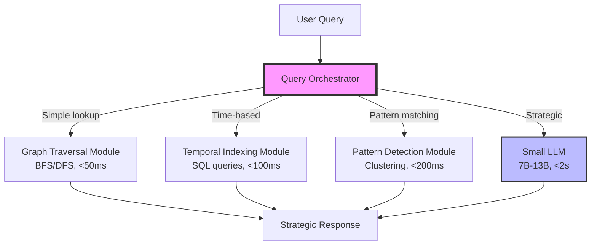

# Hybrid Memory Agent Architecture

**Category**: Long Term (6-12 months)
**Priority**: 🟢 LOW (ADVANCED)
**Status**: Proposal
**Dependencies**: [003_proactive_memory.md](./003_proactive_memory.md), [004_knowledge_graph.md](./004_knowledge_graph.md) must be implemented

---

## Vision

Build a **hybrid memory agent** that combines:
- **Small LLM** (7B-13B) for reasoning about memory
- **Specialized non-neural modules** for fast deterministic operations
- **Orchestrator** that routes queries to the optimal component

**Goal**: Transform memory from passive storage into an **active second brain** that reasons strategically, not just retrieves.

**Inspiration**: Human memory system = hippocampus (fast recall) + prefrontal cortex (reasoning)

**Value Proposition**: "Your memory doesn't just remember—it thinks."

---

## Current State Analysis

### What Exists (After Phase 1-4)

Assuming Phase 1-4 are complete:

✅ **Reasoning-as-a-service** (001): Iterative problem solving
✅ **Structured protocol** (002): 3-level operations (L1/L2/L3)
✅ **Proactive memory** (003): Interrupt budget + pattern detection
✅ **Knowledge graph** (004): Semantic relationships + temporal reasoning

### What's Still Missing

❌ **Strategic synthesis**: Memory suggests strategies, not just facts
❌ **Query routing**: Automatic selection of optimal module for query
❌ **Small LLM reasoning**: Lightweight LLM for memory-specific tasks
❌ **Cost-benefit analysis**: Balance speed vs accuracy vs cost
❌ **Learned policies**: RL for interruption timing and routing

**Gap**: Current system is reactive. Hybrid agent is **proactive strategist**.

---

## Proposed Architecture

### High-Level Design



### Component Breakdown

#### 1. Query Orchestrator

**Responsibility**: Route incoming queries to the optimal module

**Decision Factors**:
- Query type (fact lookup, pattern search, strategic question)
- Latency requirements
- Cost constraints (LLM calls vs free modules)
- User tier (free users limited to modules, Pro gets small LLM)

**Algorithm**:
```python
class QueryOrchestrator:
    def __init__(self, modules: dict, small_llm, routing_model):
        self.graph_module = modules['graph']
        self.temporal_module = modules['temporal']
        self.pattern_module = modules['pattern']
        self.small_llm = small_llm
        self.routing_model = routing_model  # ML classifier

    async def route(self, query: str, owner_key: str, user_tier: str) -> dict:
        """Route query to optimal module"""

        # 1. Classify query complexity
        query_class = await self._classify_query(query)

        # 2. Route based on classification
        if query_class == "simple_fact_lookup":
            # Use graph module (fast, deterministic)
            return await self.graph_module.get(query, owner_key)

        elif query_class == "temporal_query":
            # Use temporal module (SQL query)
            return await self.temporal_module.query(query, owner_key)

        elif query_class == "pattern_search":
            # Use pattern detection module
            return await self.pattern_module.search(query, owner_key)

        elif query_class == "strategic":
            # Use small LLM (reasoning required)
            if user_tier in ["pro", "team", "enterprise"]:
                return await self.small_llm.reason(query, owner_key)
            else:
                # Fallback for free tier: best effort with modules
                return await self._module_fallback(query, owner_key)

        else:
            # Unknown: try small LLM
            return await self.small_llm.reason(query, owner_key)

    async def _classify_query(self, query: str) -> str:
        """Classify query type using ML model"""

        # Extract features
        features = {
            "length": len(query.split()),
            "has_question_words": any(w in query.lower() for w in ["how", "why", "what", "when"]),
            "has_temporal_words": any(w in query.lower() for w in ["when", "before", "after", "timeline"]),
            "has_strategic_words": any(w in query.lower() for w in ["strategy", "approach", "should i", "recommend"]),
            "complexity_score": self._estimate_complexity(query)
        }

        # Classify
        query_class = await self.routing_model.predict(features)
        return query_class

    def _estimate_complexity(self, query: str) -> float:
        """Heuristic complexity score (0.0-1.0)"""
        score = 0.0

        # Length factor
        word_count = len(query.split())
        score += min(word_count / 50, 0.3)  # Max 0.3 for length

        # Question depth
        question_words = ["how", "why", "explain"]
        if any(w in query.lower() for w in question_words):
            score += 0.4

        # Multi-part questions
        if "and" in query or ";" in query:
            score += 0.2

        # Requires reasoning
        if "should" in query.lower() or "recommend" in query.lower():
            score += 0.3

        return min(score, 1.0)
```

---

#### 2. Graph Traversal Module

**Responsibility**: Fast graph operations (BFS/DFS, shortest path)

**Use Cases**:
- "What are the prerequisites for X?"
- "Find all implications of Y"
- "Detect contradictions"

**Implementation** (from 004):
```python
class GraphTraversalModule:
    def __init__(self, db):
        self.db = db

    async def traverse(
        self,
        start_node_id: str,
        edge_type: str,
        max_depth: int = 3,
        direction: str = "outgoing"
    ) -> List[dict]:
        """BFS graph traversal"""

        visited = set()
        queue = [(start_node_id, 0)]
        results = []

        while queue:
            node_id, depth = queue.pop(0)

            if node_id in visited or depth > max_depth:
                continue

            visited.add(node_id)

            # Fetch node
            node = await self.db.fetch_one(
                "SELECT * FROM knowledge_nodes WHERE id = %s",
                (node_id,)
            )
            results.append({**node, "depth": depth})

            # Find neighbors
            if direction == "outgoing":
                edge_query = "SELECT target_node_id FROM knowledge_edges WHERE source_node_id = %s AND edge_type = %s"
            else:
                edge_query = "SELECT source_node_id FROM knowledge_edges WHERE target_node_id = %s AND edge_type = %s"

            neighbors = await self.db.fetch_all(edge_query, (node_id, edge_type))

            for neighbor in neighbors:
                neighbor_id = neighbor['target_node_id'] if direction == "outgoing" else neighbor['source_node_id']
                queue.append((neighbor_id, depth + 1))

        return results

    async def find_shortest_path(
        self,
        start_id: str,
        end_id: str,
        edge_type: str = None
    ) -> List[str]:
        """Find shortest path between two nodes"""
        # Dijkstra's algorithm implementation
        pass
```

**Performance**: < 50ms for depth-3 traversal on graph with 100k nodes

---

#### 3. Temporal Indexing Module

**Responsibility**: Time-based queries (SQL-powered)

**Use Cases**:
- "What did I learn last week?"
- "Show me memories from before I learned X"
- "Timeline of my beliefs about Y"

**Implementation**:
```python
class TemporalIndexingModule:
    def __init__(self, db):
        self.db = db

    async def query_range(
        self,
        owner_key: str,
        start_time: datetime,
        end_time: datetime,
        node_types: List[str] = None
    ) -> List[dict]:
        """Query nodes within time range"""

        conditions = ["owner_key = %s", "created_at BETWEEN %s AND %s"]
        params = [owner_key, start_time, end_time]

        if node_types:
            conditions.append("node_type = ANY(%s)")
            params.append(node_types)

        query = f"SELECT * FROM knowledge_nodes WHERE {' AND '.join(conditions)} ORDER BY created_at"
        return await self.db.fetch_all(query, tuple(params))

    async def get_evolution(
        self,
        owner_key: str,
        topic_embedding: List[float],
        similarity_threshold: float = 0.8
    ) -> List[dict]:
        """Get temporal evolution of beliefs about a topic"""

        query = """
        SELECT n.*, 1 - (n.embedding <=> %s::vector) AS similarity
        FROM knowledge_nodes n
        WHERE n.owner_key = %s
          AND n.node_type IN ('FACT', 'HYPOTHESIS')
          AND 1 - (n.embedding <=> %s::vector) > %s
        ORDER BY n.created_at
        """

        return await self.db.fetch_all(
            query,
            (topic_embedding, owner_key, topic_embedding, similarity_threshold)
        )
```

**Performance**: < 100ms (indexed SQL queries)

---

#### 4. Pattern Detection Module

**Responsibility**: Clustering, pattern recognition (from 003)

**Use Cases**:
- "Find similar failures"
- "Group related memories"
- "Detect recurring themes"

**Implementation**:
```python
class PatternDetectionModule:
    def __init__(self, embeddings_model):
        self.embeddings = embeddings_model

    async def cluster_memories(
        self,
        memory_ids: List[str],
        n_clusters: int = 5
    ) -> dict:
        """Cluster memories using K-means"""

        from sklearn.cluster import KMeans

        # Fetch embeddings
        embeddings = []
        for id in memory_ids:
            mem = await db.fetch_one("SELECT embedding FROM knowledge_nodes WHERE id = %s", (id,))
            embeddings.append(mem['embedding'])

        # Cluster
        kmeans = KMeans(n_clusters=n_clusters)
        labels = kmeans.fit_predict(embeddings)

        # Group by cluster
        clusters = {}
        for i, label in enumerate(labels):
            if label not in clusters:
                clusters[label] = []
            clusters[label].append(memory_ids[i])

        return clusters

    async def detect_themes(
        self,
        owner_key: str,
        min_cluster_size: int = 3
    ) -> List[dict]:
        """Detect recurring themes in memories"""

        # Fetch all memories
        memories = await db.fetch_all(
            "SELECT id, embedding FROM knowledge_nodes WHERE owner_key = %s",
            (owner_key,)
        )

        # Cluster (DBSCAN for automatic cluster detection)
        from sklearn.cluster import DBSCAN
        embeddings = [m['embedding'] for m in memories]
        clustering = DBSCAN(eps=0.3, min_samples=min_cluster_size).fit(embeddings)

        # Extract themes
        themes = []
        for label in set(clustering.labels_):
            if label == -1:  # Noise
                continue

            cluster_ids = [memories[i]['id'] for i, l in enumerate(clustering.labels_) if l == label]
            themes.append({
                "theme_id": label,
                "memory_count": len(cluster_ids),
                "representative_memories": cluster_ids[:5]
            })

        return themes
```

**Performance**: < 200ms for 1000 memories

---

#### 5. Small LLM for Strategic Reasoning

**Responsibility**: Reasoning tasks that require understanding and synthesis

**Use Cases**:
- "What's my overall strategy for X?"
- "Explain why my approach failed"
- "Suggest next steps based on my history"

**Model Options**:

| Model | Size | Speed | Cost | Quality |
|-------|------|-------|------|---------|
| **Llama 3.2 8B** | 8B | Fast (< 2s) | Free (self-hosted) | Good |
| **Gemma 7B** | 7B | Fast (< 2s) | Free (self-hosted) | Good |
| **GPT-4o-mini** | Unknown | Fast (< 1s) | $0.15/1M tokens | Excellent |
| **Claude Haiku** | Unknown | Fast (< 1s) | $0.25/1M tokens | Excellent |

**Recommendation**:
- **Free/Pro tiers**: GPT-4o-mini (API, cheap, fast)
- **Team tier**: Option to BYO API keys
- **Enterprise**: Self-hosted Llama 3.2 8B (GPU instance)

**Implementation**:
```python
class SmallLLMReasoner:
    def __init__(self, model: str, llm_client):
        self.model = model  # "gpt-4o-mini" or "llama-3.2-8b"
        self.llm = llm_client

    async def reason(self, query: str, owner_key: str) -> dict:
        """Strategic reasoning using small LLM"""

        # 1. Retrieve relevant context (using modules)
        context_nodes = await self._gather_context(query, owner_key)

        # 2. Build strategic prompt
        prompt = self._build_strategic_prompt(query, context_nodes)

        # 3. Generate response
        response = await self.llm.generate(
            prompt=prompt,
            max_tokens=500,
            model=self.model,
            temperature=0.7
        )

        return {
            "answer": response.text,
            "reasoning_type": "strategic",
            "context_used": [n['id'] for n in context_nodes],
            "tokens_used": response.tokens_used
        }

    async def _gather_context(self, query: str, owner_key: str) -> List[dict]:
        """Gather relevant context using modules"""

        # Use pattern detection to find similar memories
        query_embedding = embeddings.encode(query)
        similar = await pattern_module.search(query_embedding, owner_key, k=5)

        # Use graph traversal to get implications
        enriched = []
        for node in similar:
            enriched.append(node)

            # Add implications
            implications = await graph_module.traverse(
                node['id'],
                edge_type="IMPLIES",
                max_depth=1
            )
            enriched.extend(implications[:2])

        return enriched

    def _build_strategic_prompt(self, query: str, context_nodes: List[dict]) -> str:
        """Build prompt for strategic reasoning"""

        context_str = "\n\n".join([
            f"[{node['node_type']}] {node['content']}"
            for node in context_nodes
        ])

        prompt = f"""You are a strategic memory assistant. Based on the user's past experiences and knowledge, provide strategic advice.

User's relevant memories:
{context_str}

User's question: {query}

Provide a strategic response that:
1. Synthesizes insights from past experiences
2. Suggests approaches based on what worked/failed before
3. Warns about potential pitfalls
4. Gives actionable next steps

Strategic advice:"""

        return prompt
```

---

## Routing Model Training

### Supervised Learning Approach

**Dataset**:
```csv
query,query_type,optimal_module
"What is the capital of France?",simple_fact_lookup,graph
"Show me memories from last week",temporal_query,temporal
"Find similar bugs",pattern_search,pattern
"What strategy should I use for X?",strategic,small_llm
```

**Features**:
- Query length
- Presence of keywords (when, how, why, should, recommend)
- Complexity score
- Question type (yes/no, fact, strategy)

**Model**: Random Forest Classifier (scikit-learn)

**Training**:
```python
from sklearn.ensemble import RandomForestClassifier
from sklearn.model_selection import train_test_split

class RoutingModel:
    def __init__(self):
        self.model = RandomForestClassifier(n_estimators=100)

    def train(self, training_data: List[dict]):
        """Train routing model"""

        X = [self._extract_features(d['query']) for d in training_data]
        y = [d['optimal_module'] for d in training_data]

        X_train, X_test, y_train, y_test = train_test_split(X, y, test_size=0.2)

        self.model.fit(X_train, y_train)

        accuracy = self.model.score(X_test, y_test)
        print(f"Routing accuracy: {accuracy:.2%}")

    def predict(self, query_features: dict) -> str:
        """Predict optimal module"""
        X = [list(query_features.values())]
        return self.model.predict(X)[0]

    def _extract_features(self, query: str) -> List[float]:
        """Extract features from query"""
        return [
            len(query.split()),  # Length
            int(any(w in query.lower() for w in ["when", "before", "after"])),  # Temporal
            int(any(w in query.lower() for w in ["how", "why", "explain"])),  # Complexity
            int(any(w in query.lower() for w in ["should", "recommend", "strategy"])),  # Strategic
            self._calculate_complexity_score(query)
        ]
```

---

## Implementation Phases

### Phase 5.1: Orchestrator + Modules (Weeks 29-36)

- [ ] Implement `QueryOrchestrator` class
- [ ] Integrate modules from Phases 2-4:
  - Graph module (from 004)
  - Temporal module (SQL queries)
  - Pattern module (from 003)
- [ ] Train routing model (supervised learning)
- [ ] API: `POST /v1/agent/query`
- [ ] Performance testing

**Deliverables**:
- ✅ Routing accuracy > 90%
- ✅ Module-based queries < 500ms

---

### Phase 5.2: Small LLM Integration (Weeks 37-44)

- [ ] Choose LLM: GPT-4o-mini vs Llama 3.2 8B
- [ ] If local: GPU instance setup (AWS g4dn.xlarge)
- [ ] Implement `SmallLLMReasoner` class
- [ ] Strategic prompt engineering
- [ ] Cost optimization (caching, summarization)
- [ ] Tier-based access (Pro+ only)

**Deliverables**:
- ✅ Small LLM responds in < 2s
- ✅ Strategic advice quality > 4.0/5 (user rating)

---

### Phase 5.3: RL Training (Weeks 45-52)

- [ ] Collect user feedback on routing decisions
- [ ] Build dataset: (query, module, outcome, feedback)
- [ ] Train RL policy: optimize for user satisfaction
- [ ] Online learning: improve routing over time
- [ ] Interruption policy RL (from 003)

**Deliverables**:
- ✅ RL-optimized routing > 95% accuracy
- ✅ User satisfaction +10% vs heuristic routing

---

## API Design

### POST /v1/agent/query

Unified agent endpoint with automatic routing.

**Request**:
```json
{
  "query": "What strategy should I use to debug this issue?",
  "context": {
    "current_problem": "Memory leak in production",
    "urgency": "high"
  },
  "preferences": {
    "max_latency_ms": 3000,
    "prefer_modules": false
  }
}
```

**Response**:
```json
{
  "answer": "Based on your past 5 debugging sessions, here's a strategic approach:\n\n1. Check memory profiler logs (worked 4/5 times)\n2. Look for unclosed database connections (common pattern in your codebase)\n3. Avoid restarting server immediately (failed in 3/5 cases)\n\nNext steps:\n- Run: `python -m memory_profiler app.py`\n- Check: Database connection pool config\n\nEvidence: [mem_123, mem_456, mem_789]",
  "module_used": "small_llm",
  "latency_ms": 1850,
  "tokens_used": 287,
  "context_nodes": ["mem_123", "mem_456", "mem_789"],
  "confidence": 0.87
}
```

---

## Pricing Implications

### New Tier: Enterprise with Self-Hosted LLM

| Feature | Free | Pro | Team | Enterprise |
|---------|------|-----|------|------------|
| Query routing | ✅ | ✅ | ✅ | ✅ |
| Module access | Graph, Temporal | All modules | All modules | All modules |
| Small LLM | ❌ | API (GPT-4o-mini) | API or BYO keys | Self-hosted Llama 3.2 |
| Strategic queries/day | 0 | 50 | 500 | Unlimited |

**Enterprise Add-On**: Self-hosted LLM option
- GPU instance (g4dn.xlarge): $526/month
- Setup + deployment: $5k one-time
- **Price**: $1000/month for unlimited strategic queries

---

## Success Metrics

- **Routing accuracy**: > 90% queries routed to optimal module
- **Latency**: < 500ms for module queries, < 2s for LLM queries
- **Cost savings**: 60%+ vs always using full LLM
- **User satisfaction**: 4.5+/5 stars for strategic advice
- **Strategic query success rate**: 80%+ users solve problem with advice

---

## Related Documents

- [001_reasoning_as_a_service.md](./001_reasoning_as_a_service.md) - Strategic synthesis in reasoning
- [003_proactive_memory.md](./003_proactive_memory.md) - Interruption policy RL
- [004_knowledge_graph.md](./004_knowledge_graph.md) - Graph traversal module
- [006_implementation_roadmap.md](./006_implementation_roadmap.md) - Phase 5 timeline

---

*Document Status*: ✅ Ready for Phase 5 (after 003+004 complete)
*Last Updated*: 2026-02-13
*Recommendation*: Start with GPT-4o-mini (API), migrate to self-hosted if Enterprise demand exists
