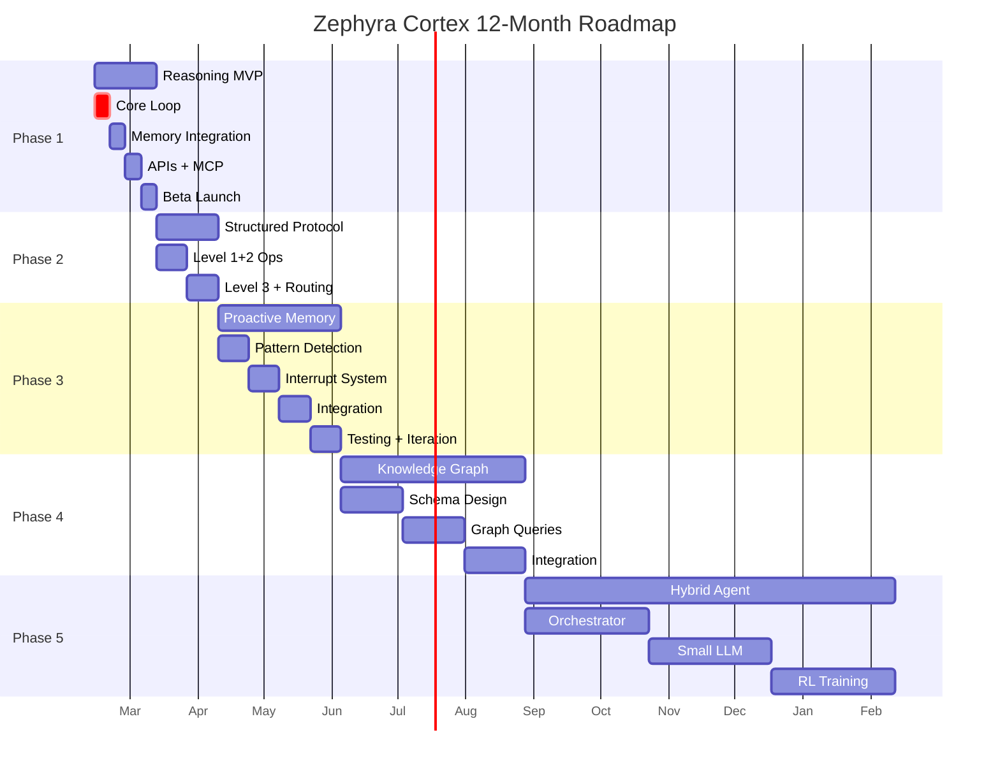

# Implementation Roadmap - 12 Month Vision

**Category**: Meta-Document (Execution Guide)
**Priority**: 🔴 HIGH
**Status**: Strategic Plan
**Timeline**: 12 months (Weeks 1-52)

---

## Overview

This document outlines the **12-month roadmap** to transform Zephyra Cortex from an AI memory platform into a comprehensive **AI Memory + Reasoning Platform** with cognitive capabilities.

**Vision**: By month 12, Zephyra will offer:
1. ✅ Reasoning-as-a-service (infinite-horizon problem solving)
2. ✅ Structured 3-level protocol (optimized memory operations)
3. ✅ Proactive memory suggestions (cognitive partner, not just storage)
4. ✅ Knowledge graph schema (semantic relationships, temporal reasoning)
5. ✅ Hybrid memory agent (orchestrated intelligence)

**Business Goals**:
- 1000+ active users
- 50+ paying customers (Pro/Team tiers)
- 5+ enterprise clients
- $10k+ MRR
- < 2s p50 latency for reasoning
- 95%+ uptime

---

## Phased Approach



---

## Phase 1: Reasoning-as-a-Service MVP (Weeks 1-4)

**Timeline**: Feb 13 - Mar 13, 2026
**Status**: 🔴 CRITICAL PATH
**Document**: [001_reasoning_as_a_service.md](./001_reasoning_as_a_service.md)

### Week 1: Core Loop + LLM Integration

**Focus**: Build the reasoning loop engine

**Tasks**:
- [ ] Create `app/services/reasoning_loop.py`
  - `ReasoningLoopService` class
  - Main `solve()` method with segment iteration
  - Context building logic
- [ ] Create `app/llm/client.py`
  - `LLMClient` abstract interface
  - `OpenAIClient` implementation
  - Response parsing and error handling
- [ ] Create `app/services/summarization.py`
  - 3 strategies: always, smart, auto
  - `llm_summarize()` function
  - Token counting and optimization
- [ ] Create `app/services/completion_detector.py`
  - Heuristic-based detection (keywords)
  - `extract_answer()` function
- [ ] Write unit tests for all components
  - Test cases: simple math, multi-step, edge cases
  - Mock LLM responses

**Deliverables**:
- ✅ Core reasoning loop works end-to-end (CLI-testable)
- ✅ Summarization produces concise summaries (< 200 tokens)
- ✅ Completion detection: 80%+ accuracy on test suite
- ✅ Unit tests: 80%+ coverage

**Files Created**: 4 new Python files (~600 lines total)

**Success Criteria**:
- Can solve "What is 25 * 17?" in 1 segment
- Can solve train speed problem in 2-3 segments
- Summaries are coherent and preserve key facts

---

### Week 2: Memory Integration + Sessions

**Focus**: Connect reasoning loop to existing memory system

**Tasks**:
- [ ] Database migration: `migrations/003_reasoning_service.sql`
  - Create `reasoning_sessions` table
  - Create `reasoning_segments` table
  - Add `reasoning_session_id` column to `memories`
- [ ] Implement session management
  - Create session on `/solve`
  - Update session status (running → completed/incomplete)
  - Link segments to sessions
- [ ] Memory integration
  - Store summaries in `memories` table
  - Retrieve relevant context via pgvector search
  - Filter by `session_id` for session-scoped context
- [ ] Context building
  - Assemble: problem + past summaries + latest summary
  - Format for LLM consumption
- [ ] Integration tests
  - End-to-end: problem → solve → memory storage
  - Verify context retrieval

**Deliverables**:
- ✅ Reasoning sessions persist to PostgreSQL
- ✅ Memory retrieval provides relevant context (top-3 similar)
- ✅ Context building preserves reasoning continuity
- ✅ Integration tests pass

**Files Modified**: `app/main.py`, `migrations/` (1 new file)

**Success Criteria**:
- Session data queryable via SQL
- Context retrieved is semantically relevant
- No memory leaks or orphaned data

---

### Week 3: APIs + MCP

**Focus**: Expose reasoning via REST and MCP protocols

**Tasks**:
- [ ] REST API endpoints
  - `POST /v1/reasoning/solve`
  - `POST /v1/reasoning/continue`
  - `GET /v1/reasoning/sessions`
  - `GET /v1/reasoning/sessions/{session_id}`
- [ ] Rate limiting
  - Add `reasoning_session` action type
  - Update `tier_definitions` with limits
  - Enforce per-tier limits
- [ ] MCP tools
  - `reasoning_solve()` tool
  - `reasoning_continue()` tool
  - `reasoning_get_trace()` tool
  - Update `mcp.json` config
- [ ] API documentation
  - OpenAPI schema update
  - Request/response examples
  - Error codes documentation

**Deliverables**:
- ✅ REST API fully functional
- ✅ MCP tools work in Claude Desktop
- ✅ Rate limits enforced (10/day for free tier)
- ✅ OpenAPI docs updated

**Files Modified**: `app/main.py`, `mcp_server.py`, `app/rate_limiter.py`

**Success Criteria**:
- Can call `/v1/reasoning/solve` via cURL and get response
- Claude Desktop can use `reasoning_solve` tool
- Free tier blocked after 10 sessions

---

### Week 4: Polish + Beta Launch

**Focus**: Multi-model support, optimization, and beta release

**Tasks**:
- [ ] Multi-model support
  - Implement `AnthropicClient` for Claude
  - Add model selection in API
  - Test both OpenAI and Anthropic
- [ ] Optimization
  - Smart summarization (only if > 500 words)
  - Parallel LLM calls where possible
  - Token usage optimization
- [ ] Error handling
  - LLM API failures (retry with backoff)
  - Database connection errors
  - Rate limit edge cases
- [ ] Monitoring
  - Add structured logging for sessions
  - Prometheus metrics (latency, tokens, status)
  - Grafana dashboard
- [ ] Documentation
  - User guide for reasoning feature
  - Beta tester onboarding
  - Landing page update
- [ ] Beta launch
  - Invite 10+ beta testers
  - Feedback collection form
  - Monitor usage patterns

**Deliverables**:
- ✅ Multi-model support (gpt-4o-mini, claude-sonnet-4)
- ✅ Smart summarization saves 30%+ tokens
- ✅ Monitoring dashboard live
- ✅ Beta launch with 10+ testers

**Files Modified**: `app/llm/client.py`, docs, monitoring config

**Success Criteria**:
- 50+ reasoning sessions completed in first week
- < 20s latency (p95) for 5 segments
- 0 critical bugs
- 4.0+ user satisfaction score

---

## Phase 2: Structured Protocol (Weeks 5-8)

**Timeline**: Mar 13 - Apr 10, 2026
**Status**: 🟡 MEDIUM PRIORITY
**Document**: [002_structured_protocol_levels.md](./002_structured_protocol_levels.md)

### Overview

Optimize memory operations by introducing **3-level protocol**:
- **Level 1**: Quick ops (SQL queries, no LLM)
- **Level 2**: Moderate ops (vector search, no text generation)
- **Level 3**: Complex ops (full LLM synthesis)

**Goal**: Reduce costs by 40%+ via automatic level selection

### Week 5: Level 1 + Level 2 Ops

**Tasks**:
- [ ] Level 1 implementation
  - `GET(entity_id)` → direct SQL query
  - `CHECK(claim)` → consistency score via embeddings
  - < 100ms latency
- [ ] Level 2 implementation
  - `SEARCH(query_embedding)` → pgvector similarity
  - `SUGGEST(context_embedding)` → proactive hints
  - < 500ms latency
- [ ] API endpoints
  - `POST /v1/memory/protocol/get`
  - `POST /v1/memory/protocol/search`

**Deliverables**:
- ✅ L1 and L2 operations functional
- ✅ Latency targets met

---

### Week 6: Level 3 + Automatic Routing

**Tasks**:
- [ ] Level 3 implementation
  - `SYNTHESIZE(query, context)` → LLM-generated response
  - `EXPLAIN(contradiction)` → clarification
- [ ] Query complexity classifier
  - Heuristic rules (keyword matching, query length)
  - Route to appropriate level
  - Fallback chain: L1 → L2 → L3
- [ ] API: `POST /v1/memory/protocol` with `auto_level=true`

**Deliverables**:
- ✅ Automatic routing works
- ✅ Response includes `level_used` metadata

---

### Week 7: Protocol API + Optimization

**Tasks**:
- [ ] Cost tracking
  - Log tokens saved per level
  - Compare L1/L2 vs always-L3
- [ ] Performance tuning
  - Index optimization for L1 queries
  - pgvector HNSW tuning for L2
- [ ] API documentation

**Deliverables**:
- ✅ `/v1/memory/protocol` endpoint live
- ✅ Cost savings > 40% vs always-L3

---

### Week 8: Testing + Documentation

**Tasks**:
- [ ] Performance benchmarks
  - Latency per level
  - Cost per query type
- [ ] Integration tests
  - End-to-end protocol calls
  - Fallback behavior
- [ ] API docs update

**Deliverables**:
- ✅ Performance benchmarks documented
- ✅ API docs updated

---

## Phase 3: Proactive Memory MVP (Weeks 9-16)

**Timeline**: Apr 10 - Jun 5, 2026
**Status**: 🟡 MEDIUM-HIGH PRIORITY
**Document**: [003_proactive_memory.md](./003_proactive_memory.md)

### Overview

Transform memory from passive storage to **active cognitive partner** that:
- Detects patterns in reasoning failures
- Proactively interrupts with suggestions
- Enforces interrupt budget to avoid spam

**Goal**: 60%+ users find suggestions helpful

### Weeks 9-10: Pattern Detection on Failures

**Tasks**:
- [ ] Extend `memories` table
  - Add `outcome` column (success/failure/unknown)
  - Add `metadata` JSONB for pattern data
- [ ] Failure detection
  - Detect failed reasoning attempts
  - Extract features: approach, context, error type
- [ ] Pattern search
  - Query memories with `type=failure`
  - Similarity search on current problem
  - Identify recurring failure patterns

**Deliverables**:
- ✅ `type=failure` memories stored
- ✅ Pattern detection identifies 70%+ recurring failures

---

### Weeks 11-12: Interrupt Budget System

**Tasks**:
- [ ] Implement `InterruptionPolicy` class
  - Budget: max 5 interrupts per session
  - Threshold: confidence > 0.8 to interrupt
  - Heuristic rules (keyword matching)
- [ ] Suggestion generation
  - Template: "Approach X failed 3x. Try Y instead."
  - Include evidence (past failure examples)
- [ ] API extension
  - Add `enable_proactive` to `POST /v1/reasoning/solve`
  - Return `interruptions` in response

**Deliverables**:
- ✅ Interrupt budget enforced
- ✅ Suggestions generated for common patterns

---

### Weeks 13-14: Integration with Reasoning Loop

**Tasks**:
- [ ] Reasoning loop integration
  - Check for patterns after each segment
  - Generate suggestion if pattern found
  - Include suggestion in reasoning trace
- [ ] User feedback collection
  - "Was this helpful? [Yes/No]"
  - Store feedback in database
- [ ] Disable option
  - Per-session toggle
  - User preference storage

**Deliverables**:
- ✅ Proactive suggestions appear during reasoning
- ✅ User feedback collected

---

### Weeks 15-16: Testing + Iteration

**Tasks**:
- [ ] A/B testing
  - Group A: proactive enabled (default)
  - Group B: proactive disabled
  - Measure: completion rate, satisfaction
- [ ] Iterate based on feedback
  - Adjust threshold if too many interrupts
  - Improve suggestion templates
- [ ] Documentation update

**Deliverables**:
- ✅ 20+ users with feedback
- ✅ 60%+ find suggestions helpful
- ✅ < 10% disable proactive mode

---

## Phase 4: Knowledge Graph (Weeks 17-28, ~3 months)

**Timeline**: Jun 5 - Aug 28, 2026
**Status**: 🟢 LOW-MEDIUM PRIORITY
**Document**: [004_knowledge_graph.md](./004_knowledge_graph.md)

### Overview

Upgrade from flat vector storage to **cognitive graph** with:
- **Node types**: FACT, PROCEDURE, PATTERN, FAILURE, HYPOTHESIS
- **Edge types**: IMPLIES, CONTRADICTS, PREREQUISITE, TEMPORAL
- **Temporal reasoning**: Track knowledge evolution
- **Consistency checking**: Detect contradictions

**Goal**: Graph queries < 200ms (p95)

### Weeks 17-20: Schema Design + Migration

**Tasks**:
- [ ] Database schema
  - Create `knowledge_nodes` table
  - Create `knowledge_edges` table
  - Add graph-specific indexes
- [ ] Migration strategy
  - Backfill existing `memories` as `FACT` nodes
  - Preserve embeddings
  - Gradual migration (no downtime)
- [ ] Graph algorithms
  - BFS/DFS for traversal
  - Cycle detection (inconsistencies)
  - Path finding (dependencies)

**Deliverables**:
- ✅ Graph schema live
- ✅ All existing memories migrated

---

### Weeks 21-24: Graph Queries + API

**Tasks**:
- [ ] Query endpoints
  - `POST /v1/graph/traverse` (find connected nodes)
  - `POST /v1/graph/temporal` (time-ordered queries)
  - `POST /v1/graph/contradictions` (detect inconsistencies)
- [ ] Temporal reasoning
  - Track knowledge evolution
  - Prune obsolete nodes (low access_frequency)
- [ ] API documentation

**Deliverables**:
- ✅ Graph query endpoints functional
- ✅ Temporal reasoning works

---

### Weeks 25-28: Integration + Optimization

**Tasks**:
- [ ] Reasoning loop integration
  - Query graph for relevant nodes (not just vector search)
  - Create edges between reasoning segments
- [ ] Performance tuning
  - Index optimization for graph queries
  - Caching frequently accessed subgraphs
- [ ] Testing
  - Graph query correctness
  - Performance benchmarks

**Deliverables**:
- ✅ Reasoning loop uses graph queries
- ✅ Graph queries < 200ms (p95)

---

## Phase 5: Hybrid Memory Agent (Weeks 29-52, ~6 months)

**Timeline**: Aug 28, 2026 - Feb 13, 2027
**Status**: 🟢 LOW PRIORITY (ADVANCED)
**Document**: [005_hybrid_memory_agent.md](./005_hybrid_memory_agent.md)

### Overview

Build **hybrid memory agent** with:
- Small LLM (7B-13B) for memory reasoning
- Specialized modules (graph traversal, pattern detection)
- Orchestrator to route queries
- RL-learned interruption policy

**Goal**: Strategic synthesis, not just retrieval

### Weeks 29-36: Orchestrator + Modules

**Tasks**:
- [ ] Orchestrator
  - Query complexity classification
  - Route to appropriate module
  - Cost-benefit analysis
- [ ] Modules
  - Graph traversal (BFS/DFS, < 50ms)
  - Temporal indexing (SQL queries)
  - Pattern detection (clustering)
- [ ] API integration

**Deliverables**:
- ✅ Orchestrator routes 90%+ queries correctly
- ✅ Modules functional

---

### Weeks 37-44: Small LLM Integration

**Tasks**:
- [ ] LLM selection
  - Evaluate: Llama 3.2 8B, Gemma 7B, GPT-4o-mini, Claude Haiku
  - Choose based on: cost, latency, quality
- [ ] Local LLM setup (if chosen)
  - GPU instance (T4 or better)
  - Model serving (vLLM or similar)
- [ ] Strategic synthesis
  - Template: "Based on past 10 attempts, strategy X = 70% success"
  - Suggestions beyond just retrieval

**Deliverables**:
- ✅ Small LLM integrated
- ✅ Strategic synthesis works

---

### Weeks 45-52: RL Training + Polish

**Tasks**:
- [ ] Dataset collection
  - (state, interrupt, outcome) tuples
  - User feedback on suggestions
- [ ] RL training
  - Binary classifier: should_interrupt(state)
  - Reward: user feedback (helpful/not helpful)
  - Online learning
- [ ] Routing classifier
  - Supervised learning: query → best module
  - Training data from usage logs
- [ ] Polish and launch
  - Enterprise tier launch
  - Self-hosted LLM option
  - Documentation

**Deliverables**:
- ✅ RL-learned interruption policy
- ✅ Routing classifier > 90% accuracy
- ✅ Enterprise tier launched

---

## Parallel Workstreams

Throughout all phases, these run in parallel:

### Marketing

**Weeks 1-12**:
- Landing page updates (highlight reasoning feature)
- Blog post: "InftyThink+ for Production"
- Twitter/LinkedIn announcements

**Weeks 13-28**:
- Case studies from beta users
- Tutorial videos (YouTube)
- Webinar: "Reasoning-as-a-Service Deep Dive"

**Weeks 29-52**:
- Enterprise marketing push
- Conference talks (AI/ML conferences)
- White paper on cognitive architectures

### Sales

**Weeks 1-12**:
- Pricing page update
- Pro tier messaging (reasoning feature)
- Email campaign to free users

**Weeks 13-28**:
- Team tier launch
- Enterprise outreach (identify prospects)
- Custom demos for large customers

**Weeks 29-52**:
- Enterprise deals (5+ contracts)
- Partnership discussions (AI platforms)
- Reseller program

### DevOps

**Weeks 1-12**:
- Monitoring setup (Prometheus + Grafana)
- Alerting (PagerDuty)
- Load testing (JMeter)

**Weeks 13-28**:
- Auto-scaling (horizontal pod autoscaling)
- Database optimization (query tuning)
- Cost monitoring (OpenAI API usage)

**Weeks 29-52**:
- Multi-region deployment (latency optimization)
- Disaster recovery (backup/restore)
- Security audit (penetration testing)

---

## Risk Mitigation

### Technical Risks

| Risk | Mitigation |
|------|------------|
| **LLM API costs exceed revenue** | Smart summarization, L1/L2 protocol, BYO API keys for Team tier |
| **Latency too high (> 20s)** | Parallel LLM calls, streaming responses, caching |
| **Database bottleneck** | Connection pooling, read replicas, pgvector optimization |
| **Context window limits** | Recursive summarization, segment pruning |

### Business Risks

| Risk | Mitigation |
|------|------------|
| **User churn after beta** | Feedback loops, iterate quickly, early access incentives |
| **Low conversion (free → Pro)** | Free tier shows value (10 sessions/day), trial period for Pro |
| **Competition** | Differentiate on cognitive features, not just storage |
| **Enterprise sales cycle too long** | Self-service Team tier, POC trials |

### Execution Risks

| Risk | Mitigation |
|------|------------|
| **Feature creep** | Strict scope per phase, no extras without user demand |
| **Technical debt** | Code reviews, refactoring sprints every 4 weeks |
| **Burnout** | Realistic timelines, no crunch, buffer time built in |

---

## Success Metrics (12 Months)

### Technical KPIs

- ✅ **Latency**: < 2s (p50), < 20s (p95) for reasoning
- ✅ **Uptime**: 95%+ (99%+ for Enterprise SLA)
- ✅ **Token efficiency**: 80%+ vs naive approach
- ✅ **Graph queries**: < 200ms (p95)

### Business KPIs

- ✅ **Active users**: 1000+
- ✅ **Paying customers**: 50+ (Pro/Team)
- ✅ **Enterprise clients**: 5+
- ✅ **MRR**: $10k+
- ✅ **Churn rate**: < 5% monthly

### User Experience KPIs

- ✅ **User satisfaction**: 4.0+/5.0 stars
- ✅ **Feature adoption**: 60%+ users try reasoning
- ✅ **Perceived value**: 70%+ say "worth the price"
- ✅ **Helpfulness**: 80%+ completed sessions rated helpful

---

## Milestones

```
Week 4  ✅ Beta Launch - Reasoning MVP live
Week 8  ✅ Structured Protocol - Cost optimization
Week 16 ✅ Proactive Memory - Cognitive partner MVP
Week 28 ✅ Knowledge Graph - Semantic reasoning
Week 52 ✅ Hybrid Agent - Full cognitive architecture
```

---

## Budget Estimates

### Development Costs (12 months)

| Phase | Weeks | Developer Time | Est. Cost |
|-------|-------|----------------|-----------|
| Phase 1 | 4 | 160 hours | $16k |
| Phase 2 | 4 | 160 hours | $16k |
| Phase 3 | 8 | 320 hours | $32k |
| Phase 4 | 12 | 480 hours | $48k |
| Phase 5 | 24 | 960 hours | $96k |
| **Total** | **52** | **2080 hours** | **$208k** |

*Assumes $100/hour blended rate (mix of senior/mid-level)*

### Infrastructure Costs

| Item | Monthly | Annual |
|------|---------|--------|
| Database (Neon Pro) | $20 | $240 |
| OpenAI API (1M tokens/day avg) | $150 | $1,800 |
| Hosting (Cloud Run) | $50 | $600 |
| Monitoring (Datadog) | $30 | $360 |
| GPU instance (Phase 5) | $200 | $2,400 |
| **Total** | **$450** | **$5,400** |

### Revenue Projections

| Tier | Users (Month 12) | Price | MRR |
|------|------------------|-------|-----|
| Free | 900 | $0 | $0 |
| Pro | 80 | $29 | $2,320 |
| Team | 15 | $99 | $1,485 |
| Enterprise | 5 | $500 | $2,500 |
| **Total** | **1000** | | **$6,305** |

**Year 1 Revenue**: ~$75k
**Year 1 Costs**: $213k (dev + infra)
**Net**: -$138k (expected for year 1 of SaaS)

**Break-even**: Expected in Year 2 with 200+ paying customers

---

## Dependencies and Sequencing

### Critical Path

```
001 Reasoning MVP → 003 Proactive Memory → 005 Hybrid Agent
                 ↓
                 002 Structured Protocol
                 ↓
                 004 Knowledge Graph
```

**Must-have for launch**: 001 (Reasoning MVP)
**High-value add-ons**: 002 (Protocol), 003 (Proactive)
**Advanced features**: 004 (Graph), 005 (Hybrid Agent)

### Parallel Execution

- 001 and 002 can start in parallel (minimal overlap)
- 003 depends on 001 (needs reasoning sessions to detect patterns)
- 004 depends on 001-003 stabilizing (foundation)
- 005 depends on 003-004 (needs graph + proactive for full value)

---

## Related Documents

- [001_reasoning_as_a_service.md](./001_reasoning_as_a_service.md) - Phase 1 detailed spec
- [002_structured_protocol_levels.md](./002_structured_protocol_levels.md) - Phase 2 spec
- [003_proactive_memory.md](./003_proactive_memory.md) - Phase 3 spec
- [004_knowledge_graph.md](./004_knowledge_graph.md) - Phase 4 spec
- [005_hybrid_memory_agent.md](./005_hybrid_memory_agent.md) - Phase 5 spec

---

## Approval and Updates

**Status**: ✅ Approved for execution
**Last Updated**: 2026-02-13
**Next Review**: End of Phase 1 (Week 4)
**Author**: Claude (Sonnet 4.5) via Zephyra planning session

**Change Log**:
- 2026-02-13: Initial roadmap created
- TBD: Updates after Phase 1 completion

---

*This roadmap is a living document and will be updated as we learn from each phase.*
