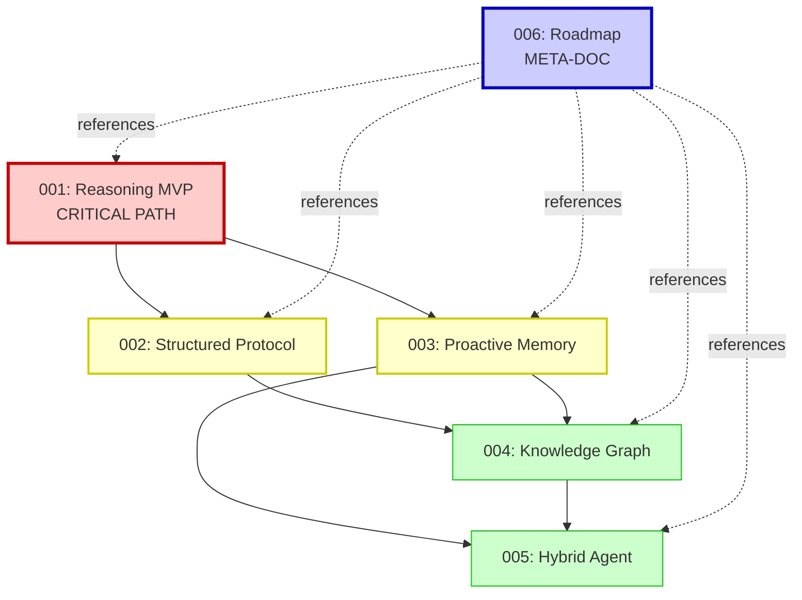

# Future Architecture Documents

This directory contains **technical specifications** for future enhancements to Zephyra Cortex (Aethera Cortex), organized by priority and implementation timeline.

**Vision**: Transform from AI Memory Platform → AI Memory + Reasoning Platform with cognitive capabilities

---

## 📚 Document Index

### 🔴 High Priority (Immediate Implementation)

#### [001 - Reasoning-as-a-Service](./001_reasoning_as_a_service.md)
**Timeline**: Weeks 1-4 (2-4 weeks)
**Status**: Ready for implementation
**Dependencies**: None

**What it does**: Enables AI agents to solve complex, multi-step problems using InftyThink+ inspired reasoning loops with automatic memory management.

**Key Features**:
- Iterative reasoning with segment summarization
- Automatic memory storage and retrieval
- Completion detection
- Multi-model support (OpenAI, Anthropic)
- REST API + MCP tools

**Why prioritize**: Immediate competitive differentiation, implementable with current stack

---

#### [006 - Implementation Roadmap](./006_implementation_roadmap.md)
**Timeline**: 12 months (complete evolution)
**Status**: Strategic planning document
**Dependencies**: None (meta-document)

**What it does**: Provides the complete 12-month roadmap for implementing all future features with phases, milestones, and success metrics.

**Phases**:
1. Reasoning MVP (Weeks 1-4)
2. Structured Protocol (Weeks 5-8)
3. Proactive Memory (Weeks 9-16)
4. Knowledge Graph (Weeks 17-28)
5. Hybrid Agent (Weeks 29-52)

**Why prioritize**: Execution guide for the entire transformation

---

### 🟡 Medium Priority (Medium Term)

#### [002 - Structured Protocol Levels](./002_structured_protocol_levels.md)
**Timeline**: Weeks 5-8 (1-2 months after 001)
**Status**: Proposal
**Dependencies**: [001](./001_reasoning_as_a_service.md) must be stable

**What it does**: Optimizes memory operations with 3-level protocol (Quick/Moderate/Complex) to reduce costs by 40%+.

**Levels**:
- **Level 1**: SQL queries, < 100ms, $0
- **Level 2**: Vector search, < 500ms, $0
- **Level 3**: LLM synthesis, < 3s, $0.01-0.10

**Why medium term**: Requires 001 to be stable first, cost optimization

---

#### [003 - Proactive Memory](./003_proactive_memory.md)
**Timeline**: Weeks 9-16 (2-4 months after 001)
**Status**: Proposal
**Dependencies**: [001](./001_reasoning_as_a_service.md) (needs reasoning sessions)

**What it does**: Transforms memory into active cognitive partner that proactively interrupts reasoning with failure pattern suggestions.

**Key Features**:
- Failure pattern detection
- Interrupt budget system
- Proactive suggestions ("⚠️ Approach X failed 3 times...")
- User feedback loop
- RL-learned interruption policy (future)

**Why medium-high term**: Differentiating feature but requires data from 001

---

### 🟢 Low Priority (Long Term)

#### [004 - Knowledge Graph](./004_knowledge_graph.md)
**Timeline**: Weeks 17-28 (4-6 months)
**Status**: Proposal
**Dependencies**: [001](./001_reasoning_as_a_service.md), [002](./002_structured_protocol_levels.md), [003](./003_proactive_memory.md) should be stable

**What it does**: Upgrades from flat vector storage to cognitive knowledge graph with semantic relationships and temporal reasoning.

**Node Types**: FACT, PROCEDURE, PATTERN, FAILURE, HYPOTHESIS

**Edge Types**: IMPLIES, CONTRADICTS, PREREQUISITE, TEMPORAL, SIMILAR_TO, CAUSED_BY

**Key Features**:
- Contradiction detection
- Dependency tracking
- Knowledge evolution over time
- Graph traversal queries

**Why long term**: Complex migration, incremental benefit over vector search

---

#### [005 - Hybrid Memory Agent](./005_hybrid_memory_agent.md)
**Timeline**: Weeks 29-52 (6-12 months)
**Status**: Proposal
**Dependencies**: [003](./003_proactive_memory.md), [004](./004_knowledge_graph.md)

**What it does**: Builds hybrid memory agent with small LLM (7B-13B) + specialized modules + orchestrator for strategic reasoning.

**Components**:
- **Query Orchestrator**: Routes queries to optimal module
- **Graph Traversal Module**: BFS/DFS, < 50ms
- **Temporal Indexing Module**: SQL queries, < 100ms
- **Pattern Detection Module**: Clustering, < 200ms
- **Small LLM**: GPT-4o-mini or Llama 3.2 8B, < 2s

**Key Features**:
- Strategic synthesis (not just retrieval)
- Automatic routing (cost-benefit analysis)
- RL-learned routing policy

**Why long term**: Research-heavy, requires 003+004 foundation

---

## 🗺️ Dependency Graph

---

## 🎯 Implementation Strategy

### Critical Path (Must-Have for Launch)
1. ✅ [001 - Reasoning-as-a-Service](./001_reasoning_as_a_service.md)

### High-Value Add-Ons
2. ✅ [002 - Structured Protocol](./002_structured_protocol_levels.md) (cost optimization)
3. ✅ [003 - Proactive Memory](./003_proactive_memory.md) (differentiation)

### Advanced Features (Enterprise/Future)
4. ✅ [004 - Knowledge Graph](./004_knowledge_graph.md) (semantic layer)
5. ✅ [005 - Hybrid Agent](./005_hybrid_memory_agent.md) (cognitive architecture)

---

## 📊 Success Metrics (12 Months)

### Technical KPIs
- **Latency**: < 2s (p50), < 20s (p95) for reasoning
- **Uptime**: 95%+ (99%+ for Enterprise)
- **Token efficiency**: 80%+ vs naive approach
- **Cost savings**: 40%+ via protocol levels

### Business KPIs
- **Active users**: 1000+
- **Paying customers**: 50+ (Pro/Team)
- **Enterprise clients**: 5+
- **MRR**: $10k+

### User Experience KPIs
- **User satisfaction**: 4.0+/5.0 stars
- **Feature adoption**: 60%+ try reasoning
- **Helpfulness**: 80%+ sessions rated helpful

---

## 🚀 Getting Started

### For Developers

**Start here**:
1. Read [001 - Reasoning-as-a-Service](./001_reasoning_as_a_service.md) for immediate implementation
2. Review [006 - Implementation Roadmap](./006_implementation_roadmap.md) for full 12-month plan
3. Check [ARCHITECTURE.md](../../ARCHITECTURE.md) for current system design

**Implementation order**:
- Week 1-4: Implement 001 (Reasoning MVP)
- Week 5-8: Implement 002 (Protocol optimization)
- Week 9-16: Implement 003 (Proactive memory)
- Week 17-28: Implement 004 (Knowledge graph)
- Week 29-52: Implement 005 (Hybrid agent)

### For Product/Business

**Messaging Evolution**:
- **Today**: "AI Memory Platform for your agents"
- **After 001**: "AI Memory + Reasoning Platform - solve complex problems without context limits"
- **After 003**: "AI Memory that thinks proactively and prevents failures"
- **After 005**: "Your AI's Second Brain - strategic partner, not just storage"

**Pricing Evolution**:
- **Free**: Basic reasoning (10 sessions/day, 3 segments)
- **Pro** ($29/mo): Advanced reasoning (500 sessions, 10 segments, all models)
- **Team** ($99/mo): Unlimited segments, BYO API keys, proactive memory
- **Enterprise**: Self-hosted LLM, knowledge graph, hybrid agent

---

## 📖 Related Documentation

- [ARCHITECTURE.md](../../ARCHITECTURE.md) - Current system architecture
- [AI_INSTRUCTIONS.md](../../AI_INSTRUCTIONS.md) - Development guidelines
- [docs/implementations/](../implementations/) - Completed features

---

## 🔄 Document Status

| Document | Status | Last Updated | Implementation Phase |
|----------|--------|--------------|----------------------|
| 001 | ✅ Ready | 2026-02-13 | Phase 1 (Weeks 1-4) |
| 002 | ✅ Ready | 2026-02-13 | Phase 2 (Weeks 5-8) |
| 003 | ✅ Ready | 2026-02-13 | Phase 3 (Weeks 9-16) |
| 004 | ✅ Ready | 2026-02-13 | Phase 4 (Weeks 17-28) |
| 005 | ✅ Ready | 2026-02-13 | Phase 5 (Weeks 29-52) |
| 006 | ✅ Ready | 2026-02-13 | Meta (Full roadmap) |

---

## 💡 Old Features (Pre-2026-02-13)

The following features were planned before the cognitive architecture redesign:
- See `001_v1.0_auto_capture.md` through `009_v2.0_frontend_dashboard.md` for previous roadmap
- These remain valid but are superseded by the new cognitive features above

---

## 🔧 Contributing

These are **living documents**. As implementation progresses:

1. **Update status** in each document (Proposal → In Progress → Complete)
2. **Document learnings** in a changelog section
3. **Refine estimates** based on actual implementation time
4. **Add new docs** for features not yet covered

---

## 📞 Questions?

For questions about:
- **Technical implementation**: See individual document's "Implementation Phases" section
- **Business strategy**: See [006 - Roadmap](./006_implementation_roadmap.md) "Pricing" and "Success Metrics" sections
- **Current architecture**: See [ARCHITECTURE.md](../../ARCHITECTURE.md)

---

*These future architectures were designed in collaboration with Claude (Sonnet 4.5) on 2026-02-13, based on analysis of InftyThink+ (2025), Extended Mind Theory (1998), and HippoRAG (2024).*
