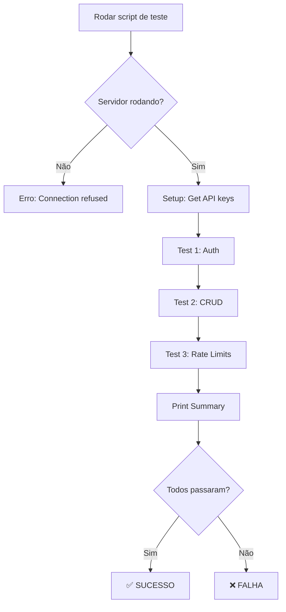

# Tests Module - Test Suite

## Propósito do Módulo

Este módulo contém a **suíte de testes** do Aethera Cortex:
- Testes de autenticação e segurança
- Testes de operações CRUD
- Testes de rate limiting e usage tracking
- Testes de integração com SDK
- Scripts de debug e validação

**Objetivo:** Garantir que todas features críticas funcionem corretamente antes de deploy.

---

## Principais Arquivos

### 1. `test_auth.py` (36 linhas)
**Propósito:** Testa sistema de autenticação e segurança básica.

**Cenários:**
- ✅ Request com chave inválida → 403 Forbidden
- ✅ Request com chave válida → 200 OK
- ✅ Request sem chave → 403 Forbidden

**Como rodar:**
```bash
# Subir servidor primeiro
uvicorn app.main:app --host 0.0.0.0 --port 8001

# Rodar teste
python tests/test_auth.py
```

**Configuração:**
- `BASE_URL`: URL do servidor (default: localhost:8001)
- `BAD_KEY`: Chave inválida para teste de invasão
- `GOOD_KEY`: Chave válida (hardcoded ou env var)

---

### 2. `test_crud.py` (50+ linhas estimado)
**Propósito:** Testa operações CRUD de memórias.

**Cenários:**
- ✅ CREATE: POST /v1/chat/completions (model=memory-only)
- ✅ READ: GET /v1/memories
- ✅ UPDATE: PUT /v1/memories/{id}
- ✅ DELETE: DELETE /v1/memories/{id}

**Como rodar:**
```bash
python tests/test_crud.py
```

**Dependências:**
- API key válida
- Servidor rodando
- Database limpo (ou tolerante a dados existentes)

---

### 3. `test_rate_limits.py` (200+ linhas)
**Propósito:** Testa enforcement de rate limiting por tier.

**Cenários principais:**
- ✅ Free tier respeita limite de 100 requests/day
- ✅ Após limite → 429 Too Many Requests
- ✅ Usage tracking registra corretamente
- ✅ Reset diário funciona
- ✅ Admin pode criar/revogar keys

**Como rodar:**
```bash
# Requer ROOT key
export AETHERA_ROOT_KEY="sk_aethera_root_..."
python tests/test_rate_limits.py
```

**Funções principais:**
- `test_usage_endpoint()`: Valida /v1/usage
- `test_rate_limit_enforcement()`: Testa limites
- `test_tier_upgrade()`: Testa upgrade de tier
- `test_admin_stats()`: Testa estatísticas admin

---

### 4. `test_sdk.py` (50+ linhas estimado)
**Propósito:** Testa integração end-to-end usando client.py SDK.

**Cenários:**
- ✅ SDK.learn() grava memória
- ✅ SDK.ask() recupera memória via RAG
- ✅ SDK CRUD operations (list, update, delete)

**Como rodar:**
```bash
python tests/test_sdk.py
```

**Exemplo de uso:**
```python
from client import SovereignBrain

brain = SovereignBrain(
    base_url="http://localhost:8001",
    api_key="sk_aethera_..."
)

# Learn
brain.learn("Python é minha linguagem favorita", session_id="test")

# Ask
response = brain.ask("Qual é minha linguagem favorita?", session_id="test")
```

---

### 5. `debug_access.py` (36 linhas)
**Propósito:** Script auxiliar para debug de autenticação.

**Uso:**
```bash
python tests/debug_access.py
```

**Funcionalidade:**
- Testa acesso com chaves diferentes
- Imprime status codes e mensagens
- Útil para troubleshooting rápido

---

## Interfaces / Contratos Importantes

### Test Function Signature
```python
def test_function_name(api_key: str) -> bool:
    """
    Test description.
    
    Args:
        api_key: Valid API key for authenticated requests
    
    Returns:
        True if test passes, False otherwise
    
    Prints:
        [PASS] or [FAIL] with details
    """
```

### Common Test Pattern
```python
def test_scenario():
    print(f"\n>>> [TEST] Scenario Name...")
    
    # 1. Setup
    # ...
    
    # 2. Execute
    response = requests.{method}(url, headers=headers, json=payload)
    
    # 3. Assert
    if response.status_code == expected:
        print(" [PASS] Description")
        return True
    else:
        print(f" [FAIL] Expected {expected}, got {response.status_code}")
        return False
```

---

## Fluxo do Módulo

### Fluxo Típico de Teste



### Ordem de Execução Recomendada

1. **test_auth.py** - Valida que auth básica funciona
2. **test_crud.py** - Valida operações de memória
3. **test_rate_limits.py** - Valida enforcement de limites
4. **test_sdk.py** - Valida integração completa

---

## Exemplos de Uso

### 1. Run All Tests (Manual)

```bash
#!/bin/bash
# Script: run_all_tests.sh

echo "Starting Aethera Test Suite..."

# Start server in background
uvicorn app.main:app --host 0.0.0.0 --port 8001 &
SERVER_PID=$!

# Wait for server to be ready
sleep 3

# Run tests
echo "=== AUTH TESTS ==="
python tests/test_auth.py

echo "=== CRUD TESTS ==="
python tests/test_crud.py

echo "=== RATE LIMIT TESTS ==="
export AETHERA_ROOT_KEY="sk_aethera_root_..."
python tests/test_rate_limits.py

echo "=== SDK TESTS ==="
python tests/test_sdk.py

# Cleanup
kill $SERVER_PID
```

### 2. Quick Smoke Test

```bash
# One-liner para validar que servidor está funcionando
python -c "import requests; r = requests.get('http://localhost:8001/'); print('OK' if r.status_code == 200 else 'FAIL')"
```

### 3. Test com Docker

```bash
# Subir container
docker-compose up -d

# Esperar servidor
sleep 5

# Rodar testes
docker exec aethera-cortex python tests/test_auth.py

# Limpar
docker-compose down
```

---

## Pontos de Atenção

### 1. ⚠️ Estado do Database
**Problema:** Testes podem deixar dados residuais no database.

**Soluções:**
- Usar `DB_SCHEMA=test` para ambiente de teste isolado
- Limpar dados entre testes: `DELETE FROM memories WHERE session_id LIKE 'test%'`
- Usar database in-memory para testes (SQLite + pgvector alternativo)

### 2. ⚠️ API Keys Hardcoded
**Problema:** Keys nos arquivos de teste podem vazar.

**Melhores práticas:**
```python
# ❌ EVITAR
GOOD_KEY = "sk_aethera_kJIhaMXBPt-DaHb9uPjWPQ"  # Hardcoded

# ✅ MELHOR
import os
GOOD_KEY = os.environ.get("AETHERA_TEST_KEY", "default-key")
```

### 3. ⚠️ Rate Limit State
**Problema:** Testes de rate limit afetam estado global.

**Impacto:**
- Rodar `test_rate_limits.py` múltiplas vezes pode falhar
- Cache in-memory reseta apenas com restart do servidor

**Solução:**
- Criar API keys temporárias para cada test run
- Limpar `usage_logs` após testes

### 4. ⚠️ Concorrência
**Problema:** Múltiplos testes rodando em paralelo podem conflitar.

**Mitigação:**
- Usar `session_id` único por teste (`test-{uuid}`)
- Rodar testes sequencialmente
- TODO: Adicionar locks ou isolation levels

### 5. ⚠️ Dependências de Rede
**Problema:** Testes falham se OpenAI API está indisponível.

**Workaround:**
- Usar `model=memory-only` quando possível (não chama LLM)
- Mock OpenAI responses para testes unitários

### 6. ⚠️ Flaky Tests
**Problema:** Testes podem falhar por timing issues.

**Sintomas:**
- "Connection refused" logo após subir servidor
- Timeout em requests lentas

**Solução:**
```python
import time
# Aguardar servidor estar pronto
time.sleep(3)

# Aumentar timeout
requests.get(url, timeout=10)  # Default é 5s
```

---

## Testes do Módulo

### Como Validar os Próprios Testes

**Meta-teste 1: Servidor deve estar rodando**
```bash
curl http://localhost:8001/
# Espera: 200 OK com {"message": "..."}
```

**Meta-teste 2: API key funciona**
```bash
curl -H "x-api-key: YOUR_KEY" http://localhost:8001/v1/memories
# Espera: 200 OK com {"data": [...]}
# Ou: 403 se key inválida
```

**Meta-teste 3: Database acessível**
```bash
psql $DATABASE_URL -c "SELECT COUNT(*) FROM memories;"
# Espera: Número >= 0
```

### Critérios de Sucesso

**Mínimos aceitáveis:**
- ✅ Zero exceptions não tratadas
- ✅ Todos prints mostram `[PASS]` ou `[FAIL]` claro
- ✅ Exit code 0 se tudo passa
- ✅ Documentação de como rodar cada teste

**Ideais:**
- ✅ Cleanup automático após cada teste
- ✅ Assertions com mensagens descritivas
- ✅ Coverage > 80% das features críticas
- ✅ Testes rodam em < 30 segundos total

---

## Testing Best Practices (Aplicáveis a Novos Testes)

### 1. Estrutura AAA (Arrange, Act, Assert)

```python
def test_feature():
    # Arrange
    api_key = get_test_key()
    payload = {"data": "test"}
    
    # Act
    response = requests.post(url, json=payload, headers={"x-api-key": api_key})
    
    # Assert
    assert response.status_code == 200
    assert "result" in response.json()
```

### 2. Fixtures para Setup/Teardown

```python
def setup_test_environment():
    """Prepare test database and keys."""
    # Create temp API key
    # Clear test session data
    return test_key

def teardown_test_environment(test_key):
    """Clean up after tests."""
    # Delete temp key
    # Clear test data
```

### 3. Testes Idempotentes

```python
# ✅ BOM - Pode rodar múltiplas vezes
def test_create_memory():
    session_id = f"test-{uuid.uuid4()}"  # Unique
    # ... test logic
    # Cleanup
    delete_test_session(session_id)

# ❌ RUIM - Quebra no segundo run
def test_create_memory():
    session_id = "test-fixed"
    # ... test logic sem cleanup
```

### 4. Mensagens de Erro Úteis

```python
# ✅ BOM
assert response.status_code == 200, \
    f"Expected 200, got {response.status_code}: {response.text}"

# ❌ RUIM
assert response.status_code == 200  # Mensagem genérica
```

---

## Comandos Úteis

### Run Tests with Coverage (TODO)

```bash
# Instalar coverage
pip install coverage

# Run com tracking
coverage run -m pytest tests/

# Generate report
coverage report -m
coverage html  # HTML report em htmlcov/
```

### Run Specific Test

```bash
# Run apenas uma função
python tests/test_auth.py::test_access

# Run com verbose
python -v tests/test_auth.py
```

### Debug Failed Tests

```bash
# Com debugger
python -m pdb tests/test_auth.py

# Com prints extras
AETHERA_DEBUG=1 python tests/test_auth.py
```

---

## Próximos Passos (TODO)

### Alta Prioridade
1. **Pytest Migration** - Migrar de scripts simples para pytest framework
2. **Fixtures** - Criar fixtures compartilhadas (test keys, sessions)
3. **CI Integration** - Rodar testes automaticamente em PRs
4. **Coverage** - Adicionar coverage reporting

### Média Prioridade
5. **Mock OpenAI** - Evitar dependência de API externa
6. **Performance Tests** - Adicionar benchmarks (latência, throughput)
7. **E2E Tests** - Testar fluxos completos (MCP + REST)

### Baixa Prioridade
8. **Load Tests** - Usar locust ou k6 para stress testing
9. **Security Tests** - Penetration testing automatizado
10. **Contract Tests** - Validar schemas de API (OpenAPI)

---

## Links Úteis

- **requests docs**: https://requests.readthedocs.io
- **pytest docs**: https://docs.pytest.org (para futuro)
- **MCP Testing**: https://spec.modelcontextprotocol.io/testing

---

_Última atualização: 2026-01-21_
